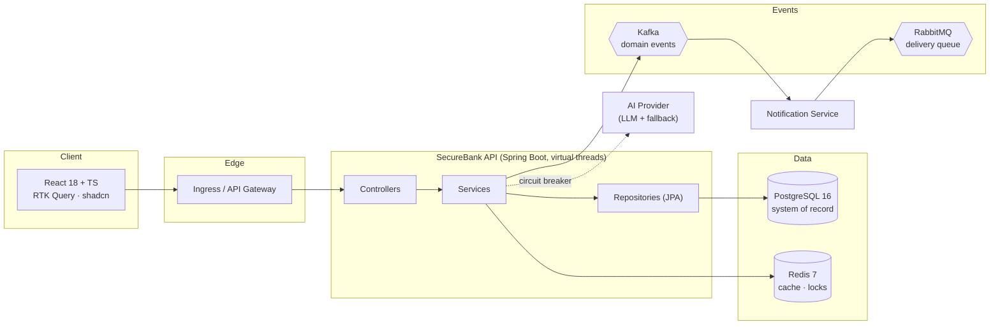

# 🏦 SecureBank

> A production-grade **digital banking platform** for the retail banking sector — built to
> demonstrate the engineering practices a real bank expects: strong consistency on money
> movement, full auditability, layered security, observability, internationalization,
> event-driven architecture, and AI-assisted features.

SecureBank is an end-to-end reference system: a **Spring Boot 3 / Java 21 (virtual threads)**
backend, a **React 18 + TypeScript** frontend, and a complete **Docker / Kubernetes / GitHub
Actions** delivery pipeline. It is intentionally over-documented so that an engineer can read it,
understand *why* every choice was made, and walk into a banking-sector interview able to defend
the design.

---

## ✨ Features

| Domain | What it does |
|---|---|
| **Identity & Access** | Registration, login, JWT access + refresh tokens, roles (`CUSTOMER`, `TELLER`, `ADMIN`), BCrypt hashing, account lockout after failed attempts. |
| **Customer & KYC** | Customer profile, KYC status lifecycle, address. |
| **Accounts** | `SAVINGS`, `CURRENT`, `FIXED_DEPOSIT`; balance, currency, status, IBAN-like account number. |
| **Money Movement** | Deposit, withdraw, internal transfer — **atomic, double-entry, race-safe** (pessimistic + optimistic + distributed locking). |
| **Payments & Beneficiaries** | Saved payees, scheduled payments. |
| **Ledger** | Double-entry journal — every transaction produces balanced debit/credit legs. |
| **AI features** | Fraud / anomaly scoring per transaction, spending insights with NL summary, "Ask SecureBank" assistant (LLM-backed with deterministic fallback). |
| **Notifications** | Event-driven: Kafka domain events → notification service → RabbitMQ delivery queue. |
| **Audit log** | Every state change recorded immutably. |
| **Internationalization** | English / Hindi / Marathi on **both** frontend and backend. |

---

## 🧰 Tech stack

**Backend**
`Java 21 (Virtual Threads)` · `Spring Boot 3.3` · `Spring Security 6` · `Spring Data JPA` ·
`PostgreSQL 16` · `Flyway` · `Redis 7 (Redisson)` · `Apache Kafka` · `RabbitMQ` ·
`Resilience4j` · `springdoc-openapi` · `Micrometer + Prometheus` · `MapStruct` · `Lombok` ·
`Maven` · `JUnit 5 / Mockito / Testcontainers`

**Frontend**
`React 18` · `TypeScript 5` · `Vite` · `Redux Toolkit + RTK Query` · `shadcn/ui` ·
`Tailwind CSS` · `react-i18next` · `react-router-dom v6` · `react-hook-form + zod` ·
`recharts` · `Vitest + React Testing Library`

**Infra / DevOps**
`Docker (multi-stage)` · `docker-compose` · `Kubernetes` · `kustomize` · `GitHub Actions (CI/CD → GHCR)` ·
`Prometheus + Grafana`

---

## 🖼️ Architecture at a glance



> 📸 *Screenshot placeholder — drop dashboard / transfer-flow screenshots here once the UI is built (`docs/assets/`).*

---

## 🗂️ Repository layout

```
securebank/
├── README.md                  ← you are here (system front door)
├── docs/                      ← cross-cutting, system-level documentation
│   ├── PROJECT_SPEC.md        ← single source of truth (FIXED contract)
│   ├── HLD.md                 ← high-level design
│   ├── LLD-overview.md        ← end-to-end low-level flows
│   ├── architecture.md        ← architecture narrative & trade-offs
│   ├── design-patterns.md     ← full patterns catalogue
│   ├── data-model.md          ← ER model + double-entry ledger
│   ├── security.md            ← security posture & hardening
│   ├── internationalization.md
│   ├── glossary.md
│   └── roadmap.md
├── backend/                   ← Spring Boot (Maven)
│   └── docs/                  ← backend-specific docs (LLD, API, testing)
├── frontend/                  ← React + TS + Vite
│   └── docs/                  ← frontend-specific docs (LLD, components, state)
└── infra/                     ← docker-compose, k8s, observability
    └── docs/                  ← runbooks, deployment, CI/CD
```

---

## 🚀 Quick start

The fastest path is the full-stack Docker Compose environment.

```bash
# 1. Bring up everything: API, frontend, postgres, redis, kafka, zookeeper, rabbitmq
docker compose -f infra/docker-compose.yml up --build

# App:        http://localhost:5173   (frontend)
# API:        http://localhost:8080/api
# Swagger UI:  http://localhost:8080/api/swagger-ui.html
# RabbitMQ:    http://localhost:15672
```

Running the pieces individually for development:

```bash
# Backend (Spring Boot, port 8080, context path /api)
cd backend && ./mvnw spring-boot:run

# Frontend (Vite dev server, port 5173)
cd frontend && npm install && npm run dev
```

> Detailed step-by-step instructions, environment variables, and troubleshooting live in the
> infra runbooks — see [infra/docs/runbook.md](infra/docs/runbook.md) and
> [infra/docs/deployment.md](infra/docs/deployment.md).

### 🔑 Demo credentials

Seeded by Flyway migrations for local/demo use. **Password for both: `Password123!`**

| Role | Username | Password |
|---|---|---|
| Admin | `admin` | `Password123!` |
| Customer | `customer` | `Password123!` |

> ⚠️ Demo seed data only. Never ship these credentials to any non-local environment.

---

## 📚 Documentation — table of contents

### System-level (this folder, `docs/`)
| Doc | Purpose |
|---|---|
| [PROJECT_SPEC.md](docs/PROJECT_SPEC.md) | The fixed contract: names, ports, data model, API surface. Source of truth. |
| [HLD.md](docs/HLD.md) | High-level design: context, components, event flows, NFRs, scaling. |
| [LLD-overview.md](docs/LLD-overview.md) | End-to-end low-level flows (transfer, auth, fraud, i18n) stitching backend + frontend. |
| [architecture.md](docs/architecture.md) | Architecture narrative, technology choices & why, trade-offs. |
| [design-patterns.md](docs/design-patterns.md) | Full design-patterns catalogue with where/why/snippet. |
| [data-model.md](docs/data-model.md) | ER diagram, double-entry ledger explained, money representation. |
| [security.md](docs/security.md) | Authn/authz, hashing, errors, audit, PCI-DSS hardening. |
| [internationalization.md](docs/internationalization.md) | en/hi/mr strategy across the stack. |
| [glossary.md](docs/glossary.md) | Banking + technical glossary. |
| [roadmap.md](docs/roadmap.md) | What's next / production hardening. |

### Backend (`backend/docs/`)
| Doc | Purpose |
|---|---|
| [backend/docs/backend-LLD.md](backend/docs/backend-LLD.md) | Backend low-level design: package map, classes, locking. |
| [backend/docs/api.md](backend/docs/api.md) | REST endpoint reference (also Swagger UI). |
| [backend/docs/testing.md](backend/docs/testing.md) | Testing strategy (JUnit / Mockito / Testcontainers). |

### Frontend (`frontend/docs/`)
| Doc | Purpose |
|---|---|
| [frontend/docs/frontend-LLD.md](frontend/docs/frontend-LLD.md) | Frontend low-level design: state, RTK Query, routing. |
| [frontend/docs/components.md](frontend/docs/components.md) | shadcn/ui component catalogue & conventions. |
| [frontend/docs/i18n.md](frontend/docs/i18n.md) | react-i18next usage. |

### Infra (`infra/docs/`)
| Doc | Purpose |
|---|---|
| [infra/docs/deployment.md](infra/docs/deployment.md) | Docker, Kubernetes, kustomize overlays. |
| [infra/docs/runbook.md](infra/docs/runbook.md) | Operational runbook: start/stop, troubleshooting. |
| [infra/docs/ci-cd.md](infra/docs/ci-cd.md) | GitHub Actions pipeline. |
| [infra/docs/observability.md](infra/docs/observability.md) | Prometheus / Grafana / metrics. |

> Some component-level docs are authored by their respective teams; links resolve once those
> teams land their files.

---

## 🧩 Design patterns used

SecureBank is a deliberate showcase of classic patterns applied to real banking problems.
Full catalogue with code: [docs/design-patterns.md](docs/design-patterns.md).

| Category | Pattern | Where in SecureBank |
|---|---|---|
| Creational | **Factory** | Account creation by type; transaction-leg construction. |
| Creational | **Builder** | DTOs / domain objects (Lombok `@Builder`). |
| Creational | **Singleton** | Spring-managed beans (default scope). |
| Structural | **Adapter** | AI provider adapter; Kafka/RabbitMQ broker adapters. |
| Structural | **Decorator** | Caching decorator over account reads (Redis). |
| Structural | **Repository** | Spring Data JPA repositories. |
| Behavioral | **Strategy** | Fraud-scoring strategies; LLM vs deterministic AI. |
| Behavioral | **Template Method** | `AbstractTransactionProcessor` (validate → lock → apply → record → publish). |
| Behavioral | **Chain of Responsibility** | Validation pipeline (KYC → limit → balance → fraud). |
| Behavioral | **Observer / Pub-Sub** | Domain events over Kafka. |
| Behavioral | **Specification** | JPA Specifications for audit-log / transaction search. |
| Concurrency | **Optimistic Lock** | `@Version` on `accounts`, retry with backoff. |
| Concurrency | **Pessimistic Lock** | `SELECT … FOR UPDATE` on money movement. |
| Concurrency | **Distributed Lock** | Redisson lock keyed by account id. |
| Resilience | **Circuit Breaker** | Resilience4j around the external AI call. |

---

## 📜 License & intent

This is an educational reference implementation. It models banking-grade practices but is not a
certified, PCI-DSS-audited production deployment — see the **Production hardening** sections in
[docs/security.md](docs/security.md) and [docs/roadmap.md](docs/roadmap.md) for the gap to "real".
