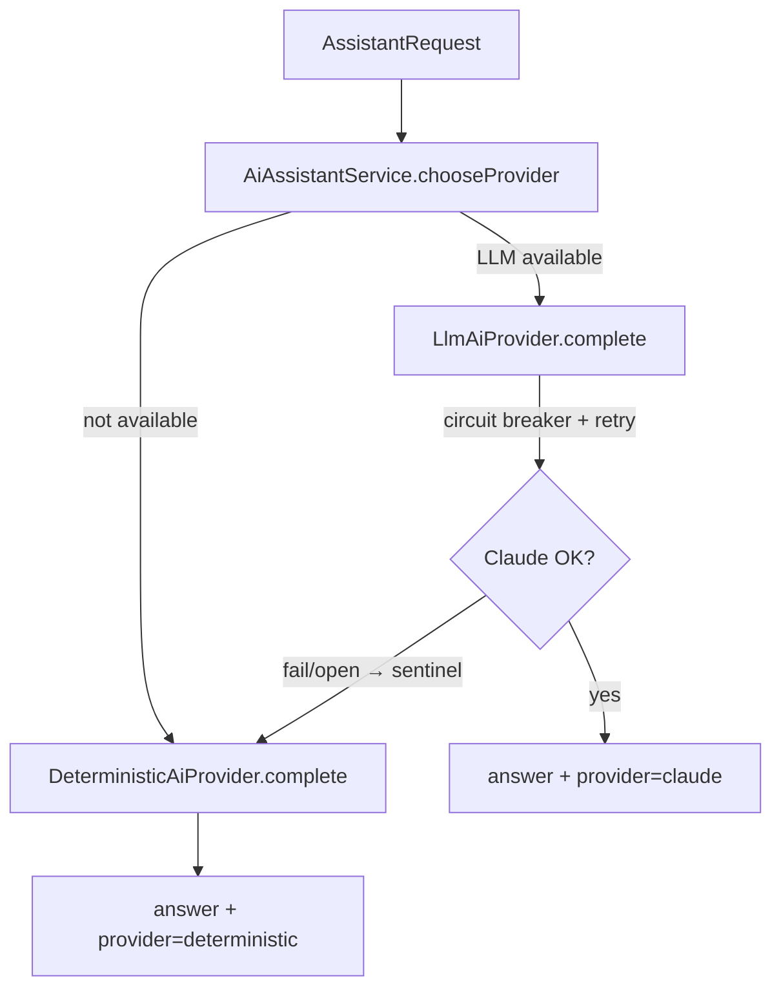

# SecureBank Backend — AI Features

Three AI-assisted capabilities, all designed to **degrade gracefully**: the API
never hard-fails because the LLM is unconfigured or unavailable.

## 1. Fraud / anomaly scoring (Strategy)

Each money movement is scored before it commits, inside the validation chain's
`FraudValidationHandler`.

- `FraudStrategy` is the pluggable algorithm interface.
  - `RuleBasedFraudStrategy` — explainable rules: large/very-large amounts,
    draining ≥90% of balance, round-number "test" amounts.
  - `StatisticalFraudStrategy` — compares the amount to the account's recent mean;
    a ≥3×/5×/10× outlier raises the score. Neutral with no history.
- `FraudScoringService` injects **all** strategies, sums their partial scores,
  clamps to `[0,1]`, and maps to a decision:
  - `score ≥ 0.80` → **BLOCK** (transaction rejected, HTTP 422)
  - `score ≥ 0.50` → **REVIEW** (allowed, but flagged)
  - else → **ALLOW**
- The processor persists a `fraud_assessments` row (score + decision + reasons
  JSONB) and stamps `transactions.fraud_score`.

Adding a new detector is just a new `@Component implements FraudStrategy` — no
other code changes.

## 2. "Ask SecureBank" assistant (Adapter + Circuit Breaker + Strategy)

Endpoint: `POST /api/assistant/ask`.



- `AiProvider` is the **Adapter** interface. `LlmAiProvider` adapts the official
  **Anthropic Java SDK** (`AnthropicOkHttpClient`, `MessageCreateParams`) to it.
- The Claude call is wrapped in a Resilience4j **circuit breaker** + **retry**
  (instance `anthropicAi`, configured in `application.yml`). On repeated failure
  the breaker opens and the fallback method returns a sentinel.
- `AiAssistantService` makes the **Strategy/config** decision per call: prefer
  Claude; on sentinel or unavailability, use `DeterministicAiProvider`.
- The response carries `provider` (`claude` or `deterministic`) so the UI is
  transparent about which backend answered.

### The Claude model

The default model is the constant `LlmAiProvider.DEFAULT_MODEL = "claude-opus-4-8"`
— the latest Claude Opus model and the recommended default for general reasoning
tasks. It is configurable via `securebank.ai.model` in `application.yml`.

### Graceful degradation (IMPORTANT)

`LlmAiProvider.isAvailable()` returns **false** when:
- `securebank.ai.enabled = false`, **or**
- `securebank.ai.api-key` is blank.

In either case the assistant and the insight summaries silently use the
deterministic provider. So the app runs end-to-end with **no API key at all** —
which is the default in `application.yml` (`api-key: ""`). When you set a real key
(e.g. via `SECUREBANK_AI_API_KEY` in the docker profile), the LLM is used
automatically.

## 3. Spending insights (deterministic numbers + AI summary)

Endpoint: `GET /api/insights/spending?days=30`.

- The **numeric breakdown** (category totals + counts) is computed
  deterministically from the customer's outgoing transactions — no AI involved,
  so the numbers are always exact and reproducible.
- The **natural-language summary** is generated by the AI provider when
  available; otherwise it falls back to a **localized template**
  (`insights.summary.template`, resolved against the caller's locale). The
  response reports `summaryProvider` (`claude` or `template`).

Categorization is a simple keyword bucket over the transaction description (Food &
Groceries, Utilities, Housing, Transport, Transfers, Other) — a stand-in for a
richer merchant-category mapping.

## 4. Configuration summary

```yaml
securebank:
  ai:
    enabled: true
    base-url: "https://api.anthropic.com"
    api-key: ""              # blank → deterministic fallback
    model: "claude-opus-4-8"
    max-tokens: 1024

resilience4j:
  circuitbreaker.instances.anthropicAi: { failure-rate-threshold: 50, wait-duration-in-open-state: 30s, ... }
  retry.instances.anthropicAi:          { max-attempts: 3, wait-duration: 500ms, ... }
```
