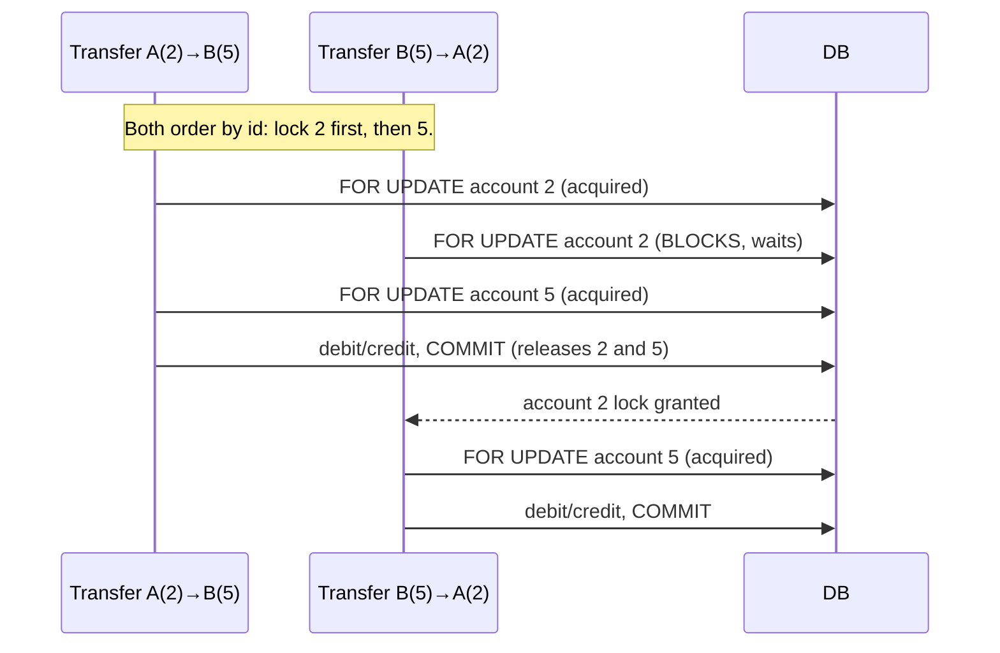
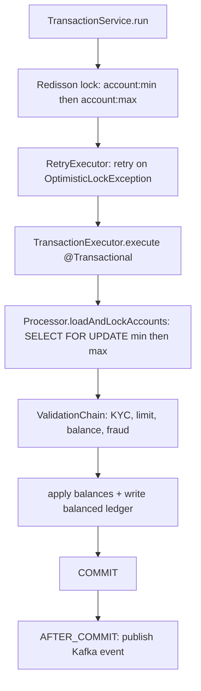

# SecureBank Backend — Concurrency & Locking

Money movement is the part where concurrency bugs become real money lost. This
document explains the three lock types, the deadlock-avoidance ordering, and how
virtual threads fit in.

## 1. The three locks, and what each protects against

| Lock | Mechanism | Protects against | Scope |
|---|---|---|---|
| **Pessimistic** | `SELECT ... FOR UPDATE` (`AccountRepository.findByIdForUpdate`) | Interleaved read-modify-write on the same row (lost updates) | Within one database transaction |
| **Optimistic** | `@Version` column + `RetryExecutor` retry-with-backoff | Lost updates on any path that doesn't hold the row lock | Per entity, detected at commit |
| **Distributed** | Redisson `RLock` (`RedissonLockManager`) | Two app instances processing the same account simultaneously | Cluster-wide |

### Optimistic vs pessimistic — when each wins
- **Pessimistic** is best when contention is likely and the critical section is
  short, which is exactly the money-movement case: we *expect* concurrent access
  to popular accounts, so we lock the row up front and avoid wasted work.
- **Optimistic** is best for low-contention updates where taking a lock would be
  overkill; here it's the safety net. The `@Version` column means even if some
  future code path updates an account without the `FOR UPDATE` lock, a concurrent
  modification is detected and `RetryExecutor` re-runs the unit.

We use **both**: pessimistic on the hot path, optimistic as a backstop.

## 2. Deadlock avoidance: deterministic id ordering

A deadlock needs a cycle: transfer A→B locks A then wants B, while transfer B→A
locks B then wants A. Neither can proceed.

We make a cycle impossible by **always acquiring locks in ascending account-id
order**, regardless of the transfer direction:

```
firstId  = min(sourceId, destId)   // lock this row first
secondId = max(sourceId, destId)   // then this one
```

With a single global ordering, there is no way to form a cycle — every
transaction reaches for the lower id before the higher id, so one transaction
always wins the race for the lower id and the other simply waits. The same
ascending order is used for the **distributed** lock keys in
`TransactionService.lockKeysFor`, so neither layer can deadlock.



No cycle ever forms, so no deadlock.

## 3. End-to-end ordering of the controls



The distributed lock is outermost (cluster coordination), the DB transaction +
row locks are innermost (the authoritative serialization), and optimistic retry
sits between them to absorb any residual collision.

## 4. Isolation level

The transactional unit runs at `READ_COMMITTED` (Postgres default). Combined with
the explicit `SELECT ... FOR UPDATE` row locks, this is sufficient for
correctness here: the row lock prevents concurrent writers, and we never rely on
repeatable-read range scans for the balance maths. Choosing `READ_COMMITTED` over
`SERIALIZABLE` avoids serialization-failure retries on unrelated rows while still
guaranteeing each account's balance integrity through the row lock.

## 5. Virtual threads

The HTTP layer runs on Project Loom virtual threads
(`spring.threads.virtual.enabled=true`). This is orthogonal to the locks but
matters for throughput:

- A virtual thread that **blocks** on a `FOR UPDATE` lock, JDBC call, or Redisson
  acquire **parks** and frees its carrier OS thread for other requests.
- So even though our money-movement path is deliberately blocking (it must be — it
  holds locks), we can have thousands of in-flight requests without thousands of
  OS threads.
- Blocking JDBC on a virtual thread is the recommended Java 21 style; no
  reactive/async rewrite is needed.

## 6. Cache coherence

After a balance change, `TransactionExecutor` calls `AccountService.evictCache`
(`@CacheEvict`) for each touched account, so the next `getById` read misses the
stale Redis entry and reloads the committed balance. The cache TTL (60s) bounds
staleness even if an eviction were ever missed.
