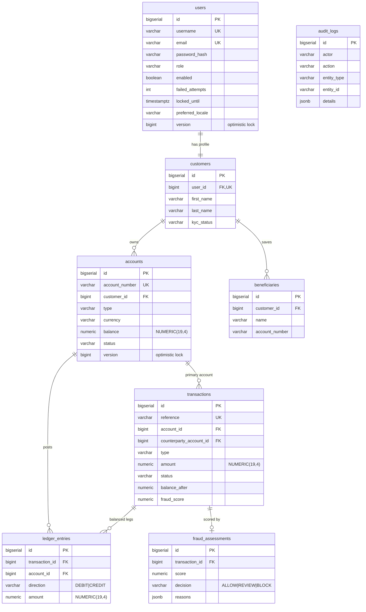

# SecureBank — Database Schema

PostgreSQL 16, managed by Flyway (`V1__schema.sql`, `V2__seed.sql`). JPA runs
`ddl-auto=validate`, so the entities must match these tables exactly.

## 1. ER diagram

## 2. Why `NUMERIC(19,4)` for money

Money is stored as `NUMERIC(19,4)` (Java `BigDecimal`) and **never** `double`:

- Binary floating point cannot represent decimal fractions like `0.10` exactly.
  Summing many such values drifts, and a bank cannot have balances that are
  "off by a paisa" — it must be exact.
- `NUMERIC(19,4)` is fixed-point decimal: 19 significant digits with 4 after the
  point. 19 digits comfortably holds any realistic balance; 4 decimal places give
  headroom for sub-cent interest/FX maths and rounding rules.
- A DB `CHECK (balance >= 0)` constraint backs up the application's
  insufficient-funds check as a last line of defence.

## 3. Double-entry explanation

`ledger_entries` is the accounting source of truth. Every balanced money movement
writes legs whose CREDIT and DEBIT amounts net to zero:

- **Deposit** → one `CREDIT` leg on the account.
- **Withdrawal** → one `DEBIT` leg on the account.
- **Transfer** → a `DEBIT` on the source **and** a `CREDIT` on the destination,
  both referencing the same `transaction` row. The two equal legs net to zero.

This makes the books self-checking: summing `CREDIT − DEBIT` for an account must
reproduce its `balance`, and the grand total across all accounts is zero. A bug
that conjured money would show up immediately as an unbalanced journal.

`transactions` is the customer-facing **summary** (one row per movement);
`ledger_entries` is the accounting **detail** (the legs).

## 4. Constraints & indexes (highlights)

- Uniqueness: `users.username`, `users.email`, `accounts.account_number`,
  `transactions.reference`.
- Enum integrity: `CHECK` constraints mirror every Java enum (role, type, status,
  direction, kyc_status, decision).
- Positivity: `CHECK (amount > 0)` on transactions and ledger legs; `CHECK
  (balance >= 0)` on accounts.
- Optimistic-lock columns: `users.version`, `accounts.version`.
- Indexes on the hot read paths: `accounts.customer_id`, `transactions
  (account_id, created_at, type)`, `ledger_entries (transaction_id, account_id)`,
  `audit_logs (actor, action, created_at)`, `fraud_assessments.transaction_id`.

## 5. JSONB columns

`audit_logs.details` and `fraud_assessments.reasons` are `jsonb`, mapped in JPA
via Hibernate 6's `@JdbcTypeCode(SqlTypes.JSON)` (a `Map`/`List`). JSONB keeps the
schema flexible (any action can attach a different detail shape) while staying
queryable in Postgres.

## 6. Seed data (`V2__seed.sql`)

- `admin / Password123!` (ADMIN) and `jsmith / Password123!` (CUSTOMER), both
  BCrypt-hashed.
- `jsmith` has a VERIFIED customer profile, two accounts
  (`SB...0001` savings, `SB...0002` current), three historical transactions with
  matching ledger legs, and one saved beneficiary.
