# SecureBank Backend — Messaging

Event-driven notifications use **Kafka** as the durable event backbone and
**RabbitMQ** as the delivery work queue. The split is deliberate: Kafka is a
replayable, multi-consumer log; RabbitMQ is a point-to-point queue with
per-message acks ideal for delivery retries.

## 1. Topics, exchange, queue (fixed by the spec)

| Kafka topics | RabbitMQ |
|---|---|
| `securebank.transactions` | exchange `securebank.notifications.exchange` (topic) |
| `securebank.fraud-alerts` | queue `securebank.notifications.queue` (durable) |
| `securebank.notifications` | binding key `notification.#` |

Topics are declared as `NewTopic` beans in `KafkaTopics`; the exchange/queue/
binding in `RabbitConfig`. Spring creates them on startup if absent.

## 2. End-to-end flow (Observer / pub-sub + work queue)

```mermaid
flowchart LR
    TX[Money movement commits] -->|AFTER_COMMIT| P1[TransactionEventProducer]
    P1 -->|securebank.transactions| K1[(Kafka)]
    K1 --> C1[TransactionNotificationConsumer]
    C1 -->|localize message| P2[NotificationProducer]
    P2 -->|securebank.notifications| K2[(Kafka)]
    K2 --> BR[NotificationBridge]
    BR -->|exchange + routing key| RMQ[(RabbitMQ exchange)]
    RMQ -->|binding notification.#| Q[(securebank.notifications.queue)]
    Q --> D[NotificationDeliveryConsumer: send email/SMS/push]
```



1. **Publish after commit.** When a transaction commits, the in-process
   `TransactionCommittedEvent` is handled by
   `@TransactionalEventListener(AFTER_COMMIT)` → `TransactionEventProducer` puts a
   `TransactionEvent` on `securebank.transactions`. Publishing only after commit
   means we never advertise a movement that rolled back.
2. **Notification service.** `TransactionNotificationConsumer` reads that topic,
   resolves the recipient's **preferred locale**, builds a localized
   `NotificationEvent`, and publishes it to `securebank.notifications` via
   `NotificationProducer`.
3. **The bridge.** `NotificationBridge` consumes `securebank.notifications` and
   republishes each event into the RabbitMQ exchange — the hand-off from the
   Kafka log to the delivery queue.
4. **Delivery.** `NotificationDeliveryConsumer` listens on
   `securebank.notifications.queue` and performs the actual send (logged here as a
   stand-in). A real failure would NACK for redelivery — the reason delivery lives
   on a work queue, not the log.

## 3. Event schemas

`TransactionEvent` (Kafka `securebank.transactions`):

```json
{
  "reference": "TXN-...",
  "accountId": 1,
  "counterpartyAccountId": 2,
  "type": "TRANSFER",
  "amount": 1000.0000,
  "currency": "INR",
  "status": "COMPLETED",
  "balanceAfter": 45500.0000,
  "fraudScore": 0.05,
  "username": "jsmith",
  "occurredAt": "2026-06-19T10:00:00Z"
}
```

`NotificationEvent` (Kafka `securebank.notifications` and RabbitMQ):

```json
{
  "username": "jsmith",
  "channel": "EMAIL",
  "subject": "SecureBank transaction alert",
  "message": "Your TRANSFER of 1000.0000 INR on account 1 completed successfully.",
  "locale": "en",
  "createdAt": "2026-06-19T10:00:01Z"
}
```

The `message` is already localized to the recipient's language — backend i18n, not
just the UI.

## 4. Serialization

- Kafka: JSON via `JsonSerializer`/`JsonDeserializer`; consumers trust
  `com.securebank.*` packages (`spring.json.trusted.packages`).
- RabbitMQ: JSON via `Jackson2JsonMessageConverter`.
- Keys: transaction events are keyed by reference, notifications by username, so
  related events keep per-key ordering on their partition.

## 5. Why two brokers (summary)

| | Kafka | RabbitMQ |
|---|---|---|
| Model | append-only log | work queue |
| Consumers | many independent groups, replayable | competing consumers, one delivery |
| Best for | the event backbone, analytics, fan-out | reliable delivery with retry/ack |

SecureBank uses each for what it's best at, with `NotificationBridge` as the
explicit seam between them.
