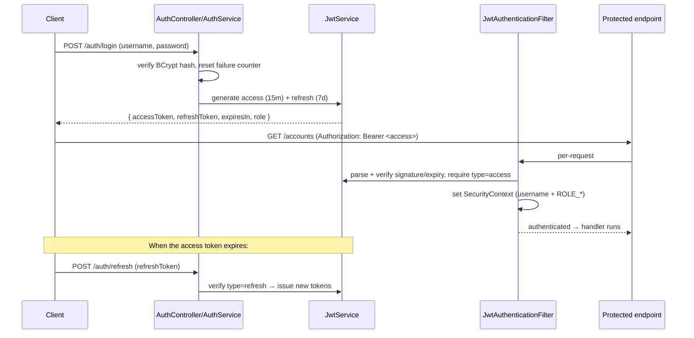

# SecureBank Backend — Security

Stateless JWT authentication, BCrypt password hashing, role-based authorization,
and account lockout.

## 1. JWT flow (access + refresh)

- **Two token types.** Access tokens are short-lived (15 min) and carry the
  username + role. Refresh tokens are longer-lived (7 days) and are accepted
  **only** at `/auth/refresh`. The filter explicitly rejects a refresh token
  presented as an API credential (`isAccessToken` check).
- **Stateless.** Tokens are HS256-signed and self-contained, so the server keeps
  no session. This suits horizontal scaling behind a load balancer.
- **Signing.** `JwtService` signs with `securebank.jwt.secret` (dev default in
  `application.yml`; in production inject from a secret manager). Issuer is
  `securebank` and is verified on parse.

## 2. BCrypt password hashing

- `SecurityConfig` exposes a `BCryptPasswordEncoder` bean.
- Registration stores `BCrypt(password)`; the plaintext never touches the DB.
- Login verifies via `passwordEncoder.matches(...)`. BCrypt is salted and
  deliberately slow, which blunts offline brute-force attacks.

## 3. Roles & authorization

Three roles (`CUSTOMER`, `TELLER`, `ADMIN`), rendered to Spring as `ROLE_*`
authorities by `AppUserDetails`. `SecurityConfig` rules:

| Path | Access |
|---|---|
| `/auth/**`, `/i18n/**` | public |
| `/swagger-ui/**`, `/v3/api-docs/**`, `/actuator/**` | public (demo convenience) |
| `/admin/**` | `ROLE_ADMIN` only |
| `/accounts/**` (GET) | authenticated |
| everything else | authenticated |

The JWT filter runs **before** the username/password filter so a valid token
populates the context first.

## 4. Account lockout

Implemented in `AuthService.login` so the count/lock bookkeeping shares the login
transaction:

- Each failed login increments `users.failed_attempts`.
- At `securebank.security.max-failed-attempts` (default **5**), `locked_until` is
  set to now + `lockout-minutes` (default **15**).
- While `locked_until` is in the future, login is refused even with the correct
  password (HTTP 423 Locked, localized message).
- A successful login resets `failed_attempts` to 0 and clears `locked_until`.

`AppUserDetails.isAccountNonLocked()` reflects the same `locked_until` so the rest
of Spring Security treats the account as locked too.

## 5. Error responses (RFC-7807, localized)

All auth failures surface through `GlobalExceptionHandler` as
`application/problem+json` with a `message` localized to the caller's
`Accept-Language`:

- bad credentials → 401 `error.auth.badCredentials`
- access denied → 403 `error.auth.accessDenied`
- account locked → 423 `error.auth.accountLocked`

## 6. Hardening notes (what a production deploy should add)

- Move the JWT secret and AI key to a secret manager (already env-driven in the
  docker profile).
- Lock down `/actuator/**` and Swagger in non-dev profiles.
- Add refresh-token rotation/revocation if you need server-side logout.
- Consider per-IP rate limiting (Redis counters) on `/auth/login`.
