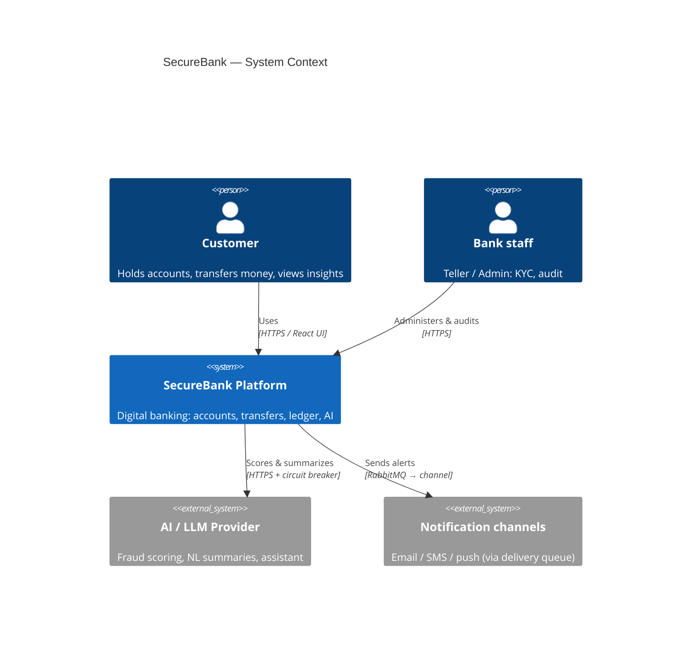
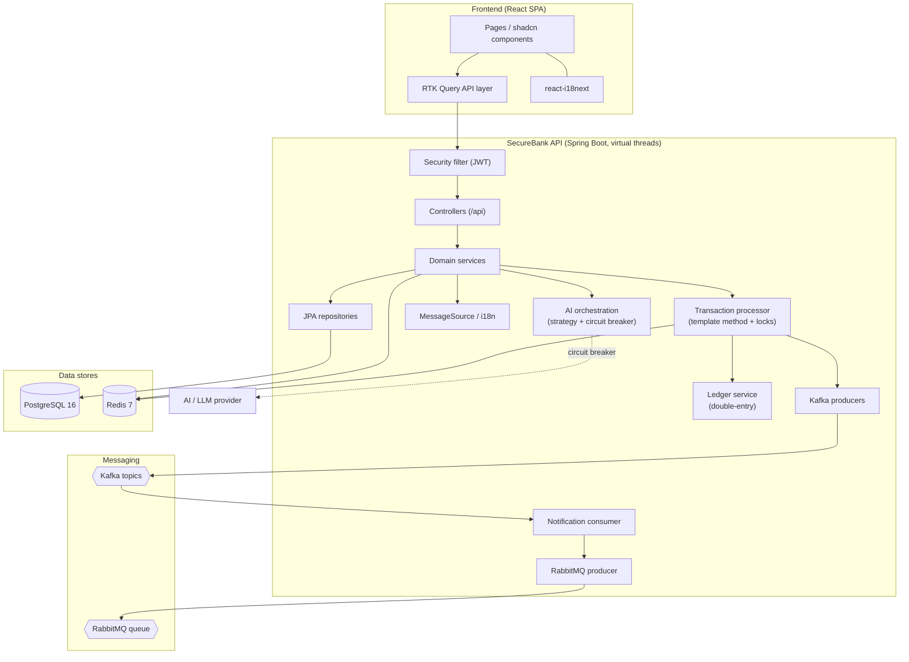
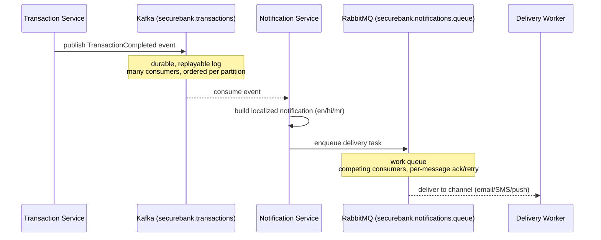
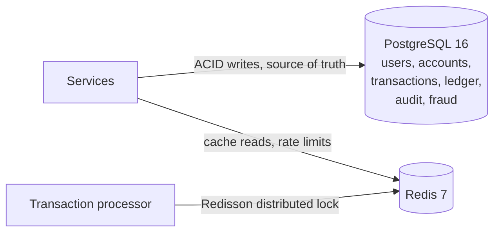
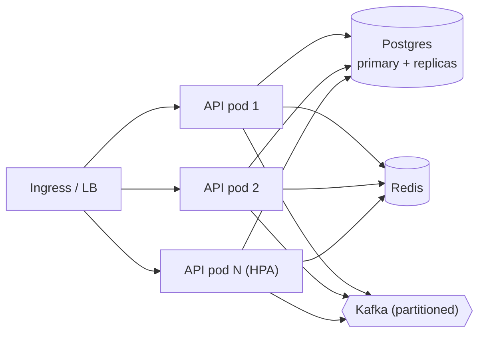

# SecureBank — High-Level Design (HLD)

> Audience: an engineer who wants the *big picture* of SecureBank before diving into any one
> component. This document is system-level. For class-level detail see
> [LLD-overview.md](LLD-overview.md), [backend-LLD](../backend/docs/backend-LLD.md), and
> [frontend-LLD](../frontend/docs/frontend-LLD.md). The fixed contract everything conforms to is
> [PROJECT_SPEC.md](PROJECT_SPEC.md).

---

## 1. Business context

SecureBank is a **retail digital banking platform**. Its customers hold accounts, move money,
save beneficiaries, and get AI-assisted insight into their spending. Bank staff (tellers and
admins) administer customers and audit activity. The defining business constraint is the one
every bank shares:

> **Money must never be created or destroyed by a software bug.** Every cent that leaves one
> account must arrive in another (or in the bank's books), and the system must be able to *prove*
> it after the fact.

That single requirement drives most of the architecture: a double-entry ledger, layered locking,
immutable audit logging, and strong transactional consistency on the system of record.

## 2. Goals and non-goals

### Goals
- **Correctness of money movement** above all — atomic, double-entry, race-safe.
- **Auditability** — every state change is recorded immutably.
- **Security** — JWT auth, role-based access, hashing, lockout, RFC-7807 errors.
- **Event-driven decoupling** — domain events fan out without blocking the request path.
- **Observability** — metrics, health, traceable flows.
- **Internationalization** — en / hi / mr across UI *and* API.
- **AI assistance** — fraud scoring, spending insights, assistant — always with a deterministic
  fallback so the bank never depends on a third party for core function.
- **Teachability** — the system is documented and commented to be *learned from*.

### Non-goals (for this reference build)
- Real card networks / SWIFT / real-money settlement.
- A certified PCI-DSS production deployment (see hardening in [security.md](security.md)).
- Multi-currency FX conversion (currency is stored, not converted).
- A native mobile app (on the [roadmap](roadmap.md)).

## 3. System context diagram (C4 level 1)

## 4. Major components and how they interact (C4 level 2)

| Component | Responsibility |
|---|---|
| **Frontend SPA** | UI, auth token handling, data fetching/caching via RTK Query, i18n strings, charts. |
| **Security filter** | Validates JWT, populates the security context, enforces roles. |
| **Controllers** | Thin HTTP adapters; map DTOs ↔ services; no business logic. |
| **Domain services** | Business rules per domain (accounts, transactions, customers, beneficiaries, insights). |
| **Transaction processor** | The locked, double-entry money-movement engine (validate → lock → apply → record → publish). |
| **Ledger service** | Produces balanced debit/credit legs for every transaction. |
| **AI orchestration** | Picks a scoring/answering strategy; wraps external calls in a circuit breaker with fallback. |
| **i18n (MessageSource)** | Localizes API messages, validation errors, notification templates. |
| **Repositories** | Spring Data JPA persistence; Specifications for dynamic search. |
| **Kafka producers / consumer** | Publish domain events; the notification service consumes and re-queues delivery. |
| **RabbitMQ producer** | Hands off to the delivery work queue. |

## 5. Event-driven flows (why two brokers)

SecureBank uses **both** Kafka and RabbitMQ — on purpose, because they solve different problems.
(Full rationale in [architecture.md](architecture.md).)

- **Kafka** is the **event backbone**: durable, replayable, ordered per partition, fan-out to many
  independent consumers (notifications, fraud analytics, audit projections). Topics:
  `securebank.transactions`, `securebank.fraud-alerts`, `securebank.notifications`.
- **RabbitMQ** is the **delivery work queue**: competing consumers, per-message ack/retry/DLQ —
  ideal for "do this one job exactly once and retry if the channel is down". Exchange
  `securebank.notifications.exchange` → queue `securebank.notifications.queue`.

## 6. Data stores

- **PostgreSQL 16** — the **system of record**. ACID transactions guarantee that balance update +
  ledger legs + transaction row commit together or not at all. Money is `NUMERIC(19,4)`. Flyway
  manages schema. See [data-model.md](data-model.md).
- **Redis 7** — caching (account lookups via a decorator), rate-limit counters, and the
  **distributed lock** (Redisson) that guards money movement across multiple API nodes.

## 7. External integrations

- **AI / LLM provider** — used for fraud scoring, NL spending summaries, and the assistant.
  Reached through an **adapter** + **strategy** behind a **Resilience4j circuit breaker**. If the
  provider is slow, failing, or unconfigured, SecureBank falls back to a deterministic rule-based
  implementation so core banking never degrades. Real key wiring is on the [roadmap](roadmap.md).
- **Notification channels** (email/SMS/push) — abstracted behind the RabbitMQ delivery queue; the
  concrete channel is a pluggable worker.

## 8. Key non-functional requirements

| NFR | How SecureBank meets it |
|---|---|
| **Consistency** | Single Postgres transaction per money move; double-entry ledger; optimistic `@Version` + pessimistic `FOR UPDATE` + Redisson distributed lock; deterministic lock ordering to avoid deadlocks. |
| **Security** | JWT access+refresh, role-based authorization, BCrypt, lockout, RFC-7807 errors, immutable audit log, secrets via env/Secrets. See [security.md](security.md). |
| **Availability** | Stateless API (scale horizontally), circuit breaker + fallback on AI, async non-blocking notification path, health/readiness probes, HPA. |
| **i18n** | en/hi/mr on both tiers; `Accept-Language` and `/api/i18n/{locale}`. See [internationalization.md](internationalization.md). |
| **Observability** | Micrometer → Prometheus metrics, actuator health, structured logs, Grafana dashboards. See [infra/docs/observability.md](../infra/docs/observability.md). |
| **Performance / scale** | Java 21 virtual threads for cheap concurrency on blocking JDBC; Redis caching; partitioned Kafka topics. |

## 9. Capacity & scaling thoughts

- **API tier** is stateless → scale out horizontally with an HPA on CPU / request latency.
  Virtual threads keep per-request memory tiny, so a single pod handles many concurrent
  I/O-bound requests cheaply.
- **Postgres** is the consistency bottleneck by design. Scale reads with replicas; keep writes on
  the primary. Money-movement throughput is bounded by row-lock contention on hot accounts — the
  distributed lock plus short critical sections keep this manageable; sharding by customer is the
  next lever.
- **Redis** scales via clustering; lock keys are per-account so contention is naturally
  distributed.
- **Kafka** scales by adding partitions (ordering is per-partition; partition by account id to
  keep per-account ordering).
- **AI calls** are bounded by the circuit breaker and never on the critical write path — they
  degrade gracefully under load.

See the [roadmap](roadmap.md) for the modular-monolith → microservices split when individual
domains need independent scaling.
