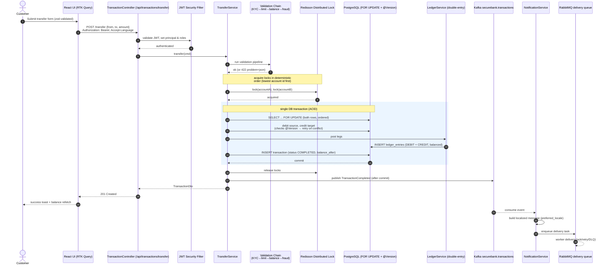
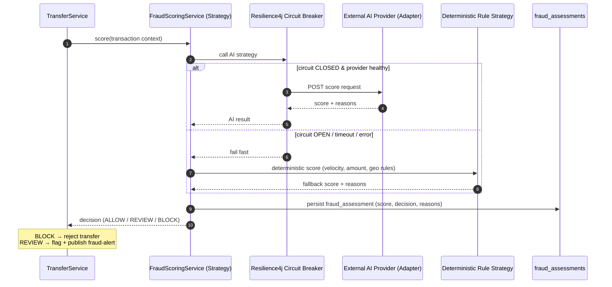

# SecureBank — Low-Level Design Overview

> This document stitches the **backend LLD** and **frontend LLD** into end-to-end flows so you can
> follow a request from a button click all the way to the ledger and back. For the per-component
> detail, see [backend-LLD](../backend/docs/backend-LLD.md) and
> [frontend-LLD](../frontend/docs/frontend-LLD.md). For the fixed API surface and data model, see
> [PROJECT_SPEC.md](PROJECT_SPEC.md).

The four flows below are the ones worth knowing cold for a banking interview:
1. [Money transfer](#1-money-transfer-the-flagship-flow) — the locked, double-entry path.
2. [Authentication](#2-authentication-jwt-access--refresh)
3. [AI fraud scoring](#3-ai-fraud-scoring)
4. [Internationalization](#4-internationalization-flow)

---

## 1. Money transfer — the flagship flow

This is the most important sequence in the system. It crosses **frontend → API → service →
locks → ledger → Kafka → notification → RabbitMQ**, and demonstrates every consistency mechanism
SecureBank has.



### Why each step exists
- **zod + react-hook-form** on the client rejects garbage early — but is never trusted; the server
  re-validates.
- **Validation chain (Chain of Responsibility)** runs ordered, cheap-to-expensive checks: KYC
  status → daily/per-tx limits → sufficient balance → fraud score. Any link can short-circuit with
  an RFC-7807 error.
- **Deterministic lock ordering** (always lock the lower account id first) prevents the classic
  A→B / B→A deadlock between two concurrent transfers.
- **Three layers of locking** (see [design-patterns.md](design-patterns.md#concurrency-patterns)):
  - *Pessimistic* `SELECT … FOR UPDATE` serializes writers on the same rows within the DB.
  - *Optimistic* `@Version` catches lost updates and triggers a bounded retry-with-backoff.
  - *Distributed* Redisson lock keyed by account id guarantees correctness across multiple API
    pods (the DB lock alone is enough for one DB, but the distributed lock keeps the critical
    section coordinated and short across nodes).
- **Double-entry ledger** posts a balanced DEBIT and CREDIT so the books always sum to zero — see
  the worked example in [data-model.md](data-model.md).
- **Publish *after* commit** — the Kafka event is emitted only once the DB transaction has
  committed, so consumers never see a notification for a transfer that rolled back.
- **Kafka → RabbitMQ split** decouples "something happened" (event) from "deliver this one
  notification, retrying if needed" (work queue).

## 2. Authentication (JWT access + refresh)

```mermaid
sequenceDiagram
  autonumber
  actor U as User
  participant FE as React (RTK Query baseQuery)
  participant API as AuthController
  participant SVC as AuthService
  participant DB as PostgreSQL (users)

  U->>FE: login(username, password)
  FE->>API: POST /api/auth/login
  API->>SVC: authenticate
  SVC->>DB: load user by username
  alt locked_until in future
    SVC-->>API: 423 Locked (problem+json)
  else password matches (BCrypt)
    SVC->>DB: reset failed_attempts
    SVC-->>API: {accessToken (short), refreshToken (long)}
  else password mismatch
    SVC->>DB: failed_attempts++, set locked_until if threshold
    SVC-->>API: 401 Unauthorized
  end
  API-->>FE: tokens
  FE->>FE: store tokens; attach Bearer on every request

  Note over FE,API: later — access token expired
  FE->>API: POST /api/auth/refresh {refreshToken}
  API->>SVC: validate refresh, issue new access token
  SVC-->>FE: new accessToken
```

- **Access token** is short-lived and sent as `Authorization: Bearer` on every API call; the RTK
  Query `baseQuery` attaches it automatically and, on a 401, transparently calls `/auth/refresh`
  once before retrying.
- **Refresh token** is long-lived and only used at the refresh endpoint.
- **Lockout**: `failed_attempts` + `locked_until` on `users` throttles brute force.
- Roles (`CUSTOMER`, `TELLER`, `ADMIN`) ride in the token and gate endpoints like
  `/api/admin/audit-logs`. Full detail in [security.md](security.md).

## 3. AI fraud scoring



- The **Strategy** pattern lets us swap "LLM-backed" and "deterministic rule" scorers behind one
  interface; the **Adapter** isolates the provider's HTTP/SDK shape; the **Circuit Breaker** makes
  the external dependency safe — if it's down, we fall back deterministically rather than failing
  the transfer.
- High-risk results publish to `securebank.fraud-alerts` and persist to `fraud_assessments`.

## 4. Internationalization flow

```mermaid
sequenceDiagram
  autonumber
  actor U as User
  participant FE as react-i18next
  participant API as Controllers
  participant MS as Spring MessageSource
  participant B as i18n bundles (en/hi/mr)

  Note over FE: UI strings resolved client-side from<br/>bundled JSON (en/hi/mr)
  U->>FE: switch language to "hi"
  FE->>FE: i18n.changeLanguage('hi'); persist preference
  FE->>API: GET /api/i18n/hi (server message bundle)
  API->>MS: load bundle
  MS->>B: messages_hi.properties
  B-->>FE: localized server-side strings

  Note over FE,API: every subsequent request
  FE->>API: any call with Accept-Language: hi
  API->>MS: resolve validation/error/notification text
  MS-->>API: localized message
  API-->>FE: problem+json {message in hi}
  FE-->>U: localized UI + localized server errors
```

- **Frontend** owns UI chrome strings via react-i18next bundles.
- **Backend** owns API-originated text — validation errors, RFC-7807 `message`, notification
  templates — via `MessageSource`, selected by the request's `Accept-Language`.
- They meet at `/api/i18n/{locale}`, so server-authored strings the UI needs can be fetched.
- Adding a locale touches both tiers in a documented way — see
  [internationalization.md](internationalization.md).

## Where to go deeper
| Topic | Doc |
|---|---|
| Backend packages, classes, locking internals | [backend/docs/backend-LLD.md](../backend/docs/backend-LLD.md) |
| Frontend state, RTK Query slices, routing | [frontend/docs/frontend-LLD.md](../frontend/docs/frontend-LLD.md) |
| Pattern-by-pattern catalogue | [design-patterns.md](design-patterns.md) |
| Ledger & money correctness | [data-model.md](data-model.md) |
