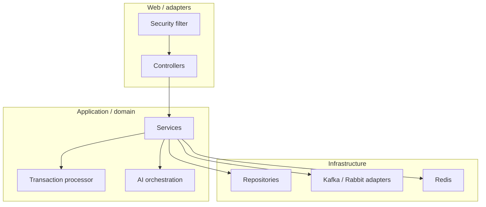
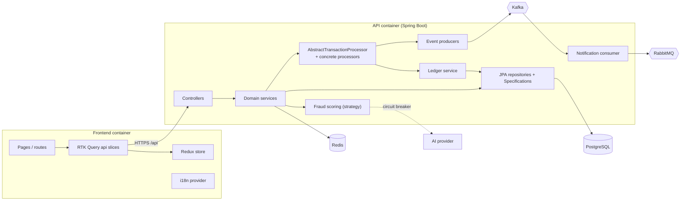
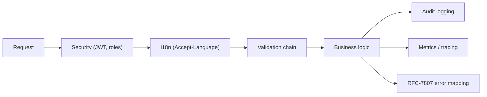

# SecureBank — Architecture Narrative

> This document explains *how SecureBank is shaped and why each major technology was chosen*. It
> is the place to understand the trade-offs. For the fixed contract see
> [PROJECT_SPEC.md](PROJECT_SPEC.md); for flows see [LLD-overview.md](LLD-overview.md); for the
> bigger picture see [HLD.md](HLD.md).

---

## 1. Architectural style

SecureBank combines three complementary styles:

1. **Layered (clean) architecture** inside the backend: `controller → service → repository`, with
   `domain`, `dto`, `mapper`, `config`, `security`, `messaging`, `ai`, `i18n`, `exception` as
   supporting packages. Dependencies point inward; the web layer is a thin adapter.
2. **Event-driven architecture** around the edges: state changes emit domain events to Kafka;
   downstream concerns (notifications, fraud analytics, audit projections) react asynchronously
   without slowing the request path.
3. **Modular monolith today → microservices-ready tomorrow**: the backend ships as one deployable
   for operational simplicity, but its packages are organized along domain seams (identity,
   accounts, transactions, ledger, ai, notifications) so they can be peeled off into services when
   a domain needs independent scaling or deployment. See [roadmap.md](roadmap.md).

## 2. C4-ish component view

## 3. Technology choices — and *why*

### Why Java 21 virtual threads (Project Loom)
Banking workloads are **I/O-bound**: a request typically waits on JDBC, Redis, Kafka, and
sometimes an AI call. Classic platform threads are expensive, so the old answer was reactive
(WebFlux) — which forces non-blocking code everywhere and is hard to read and debug. Virtual
threads let us write **plain, blocking, sequential code** (easy to teach, easy to reason about
transactions) while the JVM cheaply parks a virtual thread during each blocking call. We get
reactive-like scalability with imperative simplicity. Blocking JDBC on a virtual thread is
explicitly fine.

> Trade-off: pinning. A virtual thread pinned inside a `synchronized` block on a blocking call
> doesn't yield. We prefer `ReentrantLock` / Redisson locks over `synchronized` on hot paths, and
> keep critical sections short.

### Why PostgreSQL
It is the **system of record** and money demands ACID. Postgres gives us serializable-grade
guarantees, real `SELECT … FOR UPDATE` row locking, `NUMERIC(19,4)` exact decimal money, JSONB for
flexible audit/fraud detail, strong indexing, and mature operational tooling. A document store
would force us to hand-roll the consistency Postgres gives for free.

### Why Kafka *and* RabbitMQ (both, deliberately)
They are different tools and SecureBank uses each for what it's best at:

| | **Kafka** | **RabbitMQ** |
|---|---|---|
| Mental model | Durable, replayable **log** | Smart **work queue / broker** |
| Consumption | Many independent consumer groups read the same events | Competing consumers split the work |
| Ordering | Per-partition ordering retained | Per-queue, consumed once |
| Use in SecureBank | **Event backbone** — `securebank.transactions`, `securebank.fraud-alerts`, `securebank.notifications`; fan-out to notifications, analytics, audit projections | **Delivery queue** — `securebank.notifications.queue`; deliver each notification once, with ack/retry/DLQ |

> The clean rule: **Kafka for "this happened" (broadcast, replayable history); RabbitMQ for "do
> this one job" (targeted, retryable task).** Using one for both would mean either losing replay
> (Rabbit) or hand-building reliable per-message delivery semantics (Kafka).

### Why Redis (with Redisson)
Three jobs: (1) a **caching decorator** over hot account reads to take pressure off Postgres;
(2) **rate-limit counters** for auth and sensitive endpoints; (3) a **distributed lock** (Redisson)
keyed by account id so money movement stays correct when the API runs as multiple pods. Redis is
fast, simple, and Redisson gives a battle-tested distributed lock so we don't invent one.

### Why RTK Query (frontend data layer)
RTK Query gives us **server-state caching, automatic re-fetching, tag-based invalidation, and
loading/error state** with almost no boilerplate, on top of the Redux store we already use for
client state (auth, locale). After a transfer we just invalidate the `Account` tag and balances
refetch automatically. The alternative (hand-written thunks + manual cache) is far more code and
more bugs.

### Why shadcn/ui (+ Tailwind)
shadcn isn't a dependency black box — it **copies accessible, unstyled-by-default components into
our repo**, so we own and can audit every component (important for a banking UI), restyle with
Tailwind tokens, and avoid version lock-in. Accessibility (Radix primitives) comes built in.

### Supporting choices (briefly)
- **Flyway** — versioned, repeatable, reviewable DB migrations; the schema is code.
- **Resilience4j** — lightweight circuit breaker/retry that keeps the external AI call from taking
  down core banking.
- **MapStruct + Lombok** — compile-time DTO mapping and boilerplate removal; entities never cross
  the wire.
- **Micrometer + Prometheus + Grafana** — vendor-neutral metrics and dashboards.
- **Testcontainers** — tests run against real Postgres/Kafka/Redis, not mocks, so locking and
  migrations are tested for real.

## 4. Cross-cutting concerns

Security, i18n, validation, audit, observability, and error formatting are applied uniformly via
filters, `@ControllerAdvice`, and AOP-style cross-cutting beans rather than scattered through
business code.

## 5. Key trade-offs (honest list)

| Decision | Upside | Cost / risk | Mitigation |
|---|---|---|---|
| Monolith first | Simple ops, one transaction boundary, easy local dev | Less independent scaling | Domain-seamed packages; documented split path |
| Strong consistency on Postgres | Money correctness | Write throughput bounded by row locks | Short critical sections, distributed lock, future sharding |
| Two message brokers | Right tool per job | More infra to run/learn | docker-compose + k8s manifests; clear "Kafka vs Rabbit" rule |
| Virtual threads | Simple blocking code at scale | Pinning footguns | Avoid `synchronized` on blocking paths; load test |
| AI dependency | Smarter fraud/insights | External, flaky, costs money | Circuit breaker + deterministic fallback; never on critical write path |
| Demo seed credentials | Easy onboarding | Insecure if shipped | Local-only; hardening in [security.md](security.md) |

## 6. Where to read more
- High-level: [HLD.md](HLD.md)
- End-to-end flows: [LLD-overview.md](LLD-overview.md)
- Patterns with code: [design-patterns.md](design-patterns.md)
- Data & ledger: [data-model.md](data-model.md)
- Security: [security.md](security.md)
- Deployment: [infra/docs/deployment.md](../infra/docs/deployment.md)
