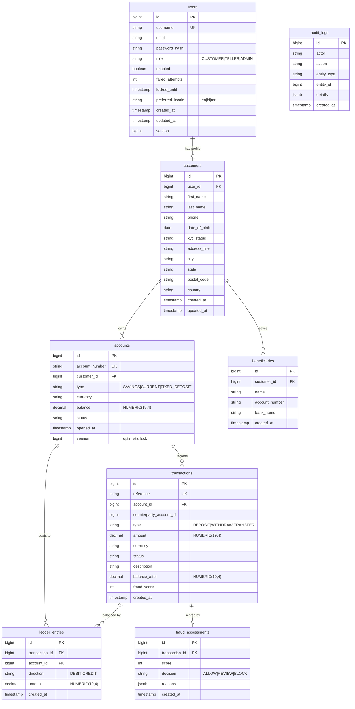
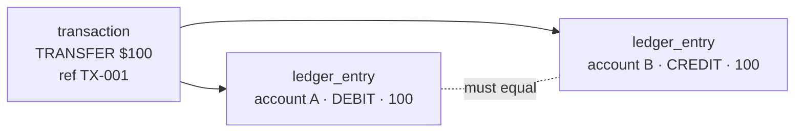
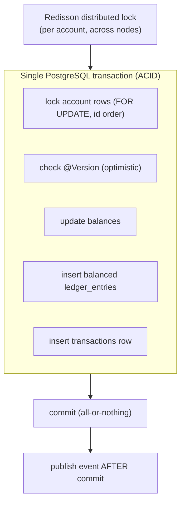

# SecureBank — System Data Model

> The system-wide data model: the entity-relationship diagram, the double-entry ledger explained
> simply with a worked example, how money is represented, and the consistency guarantees. The
> table list here is the **fixed contract** from [PROJECT_SPEC.md](PROJECT_SPEC.md#4-data-model);
> Flyway migrations under `backend/src/main/resources/db/migration` are the executable form.

---

## 1. ER overview



### Reading the relationships
- A **user** is the login identity; a **customer** is the banking profile attached to it.
- A customer **owns** many **accounts** and **saves** many **beneficiaries**.
- Each money movement is a **transaction**, which is **balanced by** two or more
  **ledger_entries** (double-entry).
- Each transaction may be **scored** by one **fraud_assessment**.
- `audit_logs` stands apart — it references entities loosely by `entity_type` + `entity_id` so it
  can record changes to anything immutably.

---

## 2. The double-entry ledger, explained simply

Banks never just "set a balance." They record every movement as **two halves that must balance**:
something is **debited** (taken from one place) and something is **credited** (given to another).
Across the whole system, **the sum of all debits always equals the sum of all credits.** If they
ever don't, you have a bug — and you can *detect* it, which is the whole point.

- `transactions` is the human-facing record ("Alice sent $100 to Bob").
- `ledger_entries` is the accountant's record — the balanced legs that prove the money is
  conserved.



### Worked example — a $100 transfer from Alice (A) to Bob (B)

Before: Account A balance = `$500.0000`, Account B balance = `$200.0000`.

Alice transfers **$100** to Bob. In **one atomic DB transaction** the system writes:

**`transactions` row**

| reference | account_id | counterparty | type | amount | status | balance_after |
|---|---|---|---|---|---|---|
| TX-001 | A | B | TRANSFER | 100.0000 | COMPLETED | 400.0000 |

**`ledger_entries` rows (the two balanced legs)**

| transaction_id | account_id | direction | amount |
|---|---|---|---|
| TX-001 | A | DEBIT | 100.0000 |
| TX-001 | B | CREDIT | 100.0000 |

**Balances updated**

| account | before | after |
|---|---|---|
| A | 500.0000 | 400.0000 |
| B | 200.0000 | 300.0000 |

**The invariant holds:** total debits (100) = total credits (100); total money in the two accounts
is unchanged (`700` before, `700` after). Nothing was created or destroyed.

> Deposits and withdrawals are modeled the same way against a bank-internal cash/clearing account,
> so *every* transaction is balanced — there is no special case that "just adds money."

---

## 3. How money is represented

| Layer | Type | Rule |
|---|---|---|
| Database | `NUMERIC(19,4)` | exact decimal, 4 fractional digits |
| Java | `BigDecimal` | never `double`/`float` for money |
| API (JSON) | string-or-number with fixed scale | preserve precision over the wire |

**Why never `double`:** binary floating point can't represent values like `0.10` exactly, so
repeated arithmetic drifts (`0.1 + 0.2 != 0.3`). For money that drift is unacceptable and unaudit-
able. `NUMERIC` / `BigDecimal` are exact base-10 decimals — `0.10 + 0.20 == 0.30` always. We also
fix the **scale (4)** and choose explicit rounding modes for any division.

```java
// correct
BigDecimal newBalance = balance.subtract(amount);   // exact
// WRONG — never do this with money
double bad = 500.0 - 100.0;                          // drifts, unauditable
```

---

## 4. Consistency guarantees



1. **Atomicity** — balance updates, ledger legs, and the transaction row commit together in one
   Postgres transaction, or all roll back. You never see half a transfer.
2. **No lost updates** — `@Version` optimistic locking detects concurrent modification; the service
   retries with backoff.
3. **No write races** — pessimistic `SELECT … FOR UPDATE` serializes writers on the same rows;
   rows are locked in **deterministic id order** so two opposite transfers can't deadlock.
4. **Multi-node correctness** — a Redisson **distributed lock** keyed by account id coordinates the
   critical section across all API pods.
5. **Events follow commits** — domain events publish only *after* the DB transaction commits, so a
   rolled-back transfer never triggers a notification.
6. **Immutable audit** — every state change is appended to `audit_logs`; rows are never updated or
   deleted.

See the patterns behind these in
[design-patterns.md](design-patterns.md#concurrency-patterns) and the full transfer sequence in
[LLD-overview.md](LLD-overview.md#1-money-transfer-the-flagship-flow).
