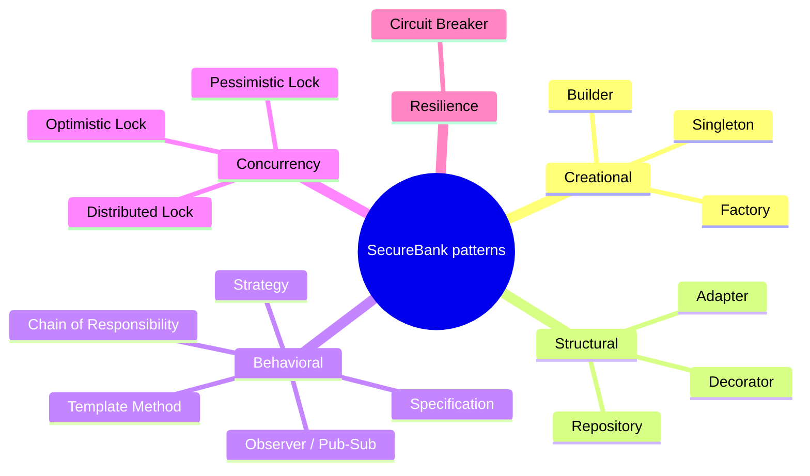
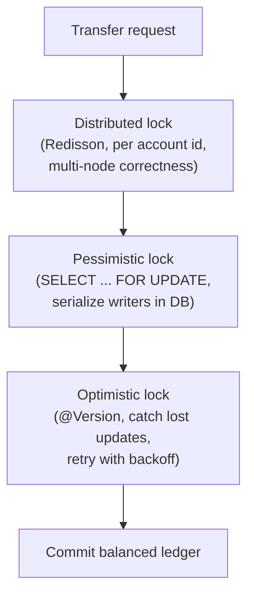
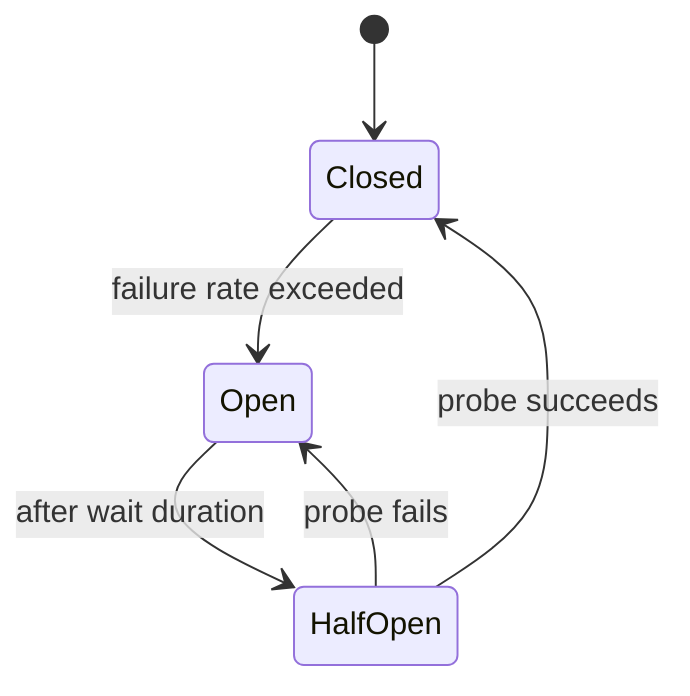

# SecureBank — Design Patterns Catalogue

> A teaching catalogue of every design pattern SecureBank uses. For each pattern you get: **what
> it is** in plain language, **where** it lives in SecureBank, **why** it was chosen there, and a
> short illustrative snippet. Snippets are *illustrative* — the canonical code lives under
> `backend/src/main/java/com/securebank/...`; see [backend-LLD](../backend/docs/backend-LLD.md).
> The fixed list of patterns to implement is in [PROJECT_SPEC.md](PROJECT_SPEC.md#6-design-patterns-to-implement-and-document).

Patterns are grouped by category:
- [Creational](#creational-patterns) — Factory, Builder, Singleton
- [Structural](#structural-patterns) — Adapter, Decorator, Repository
- [Behavioral](#behavioral-patterns) — Strategy, Template Method, Chain of Responsibility, Observer/Pub-Sub, Specification
- [Concurrency](#concurrency-patterns) — Optimistic Lock, Pessimistic Lock, Distributed Lock
- [Resilience](#resilience-patterns) — Circuit Breaker



---

## Creational patterns

### Factory
**What it is:** a single place that decides *which concrete object to build* given some input, so
callers don't litter the codebase with `new` and `switch`.

**Where:** account creation by `AccountType` (`SAVINGS` / `CURRENT` / `FIXED_DEPOSIT`) in the
account service area, and construction of double-entry ledger legs in the ledger area.

**Why:** different account types have different defaults (interest, minimum balance, allowed
operations). A factory centralizes that policy so adding a new account type is one edit, not a
hunt-and-replace.

```java
// AccountFactory — one place that knows how to build each account type.
public Account create(AccountType type, Customer owner, Currency ccy) {
    return switch (type) {
        case SAVINGS       -> baseAccount(owner, ccy).type(SAVINGS).build();
        case CURRENT       -> baseAccount(owner, ccy).type(CURRENT).overdraftAllowed(true).build();
        case FIXED_DEPOSIT -> baseAccount(owner, ccy).type(FIXED_DEPOSIT).locked(true).build();
    };
}
```

### Builder
**What it is:** construct an object step by step with readable, named "with" calls instead of a
giant constructor.

**Where:** DTOs and domain objects throughout, via Lombok `@Builder`.

**Why:** banking objects have many fields (a transaction has reference, type, amount, currency,
status, description, balance_after, fraud_score…). A builder makes construction readable and avoids
constructor-argument-order bugs.

```java
TransactionDto.builder()
    .reference(ref).type(TRANSFER).amount(amount).currency("USD")
    .status(COMPLETED).balanceAfter(newBalance).build();
```

### Singleton
**What it is:** exactly one shared instance of a thing.

**Where:** essentially every Spring `@Service`, `@Component`, `@Repository`, `@Configuration` bean —
Spring's default scope is singleton.

**Why:** stateless services should exist once and be shared; the Spring container manages the
single instance and its lifecycle so we don't hand-roll (and get wrong) classic Java singletons.

```java
@Service              // one container-managed instance, injected everywhere
public class TransferService { /* stateless: safe to share */ }
```

---

## Structural patterns

### Adapter
**What it is:** wrap a foreign interface so it looks like the interface *our* code expects.

**Where:** the **AI provider adapter** (`ai/provider`) hides the LLM vendor's HTTP/SDK shape behind
a clean `AiProvider` interface; the **message broker adapters** (`messaging/kafka`,
`messaging/rabbit`) wrap broker clients behind our publisher interfaces.

**Why:** isolates vendor specifics so swapping LLM providers or brokers is a localized change, and
keeps business code free of vendor types.

```java
public interface AiProvider {                 // what our code wants
    FraudScore score(TransactionContext ctx);
}
class OpenAiStyleAdapter implements AiProvider {  // wraps the vendor's shape
    public FraudScore score(TransactionContext ctx) {
        var resp = vendorClient.complete(toVendorRequest(ctx));
        return toFraudScore(resp);
    }
}
```

### Decorator
**What it is:** wrap an object to add behavior *without changing it*, keeping the same interface.

**Where:** a **caching decorator** over account reads — the decorator checks Redis first and only
delegates to the real repository-backed reader on a miss.

**Why:** caching is a cross-cutting concern; layering it as a decorator keeps the core read logic
clean and lets us turn caching on/off by swapping the wrapper.

```java
class CachingAccountReader implements AccountReader {
    private final AccountReader delegate;          // the real reader
    private final RedisCache cache;
    public Account byId(Long id) {
        return cache.get(id).orElseGet(() -> {
            Account a = delegate.byId(id);         // miss → real read
            cache.put(id, a);
            return a;
        });
    }
}
```

### Repository
**What it is:** a collection-like abstraction over persistence so business code says "find/save"
not "run this SQL".

**Where:** all Spring Data JPA repositories in `repository/`.

**Why:** removes boilerplate persistence code, centralizes queries, and lets services depend on an
interface rather than the database. Combines with [Specification](#specification) for dynamic
queries.

```java
public interface AccountRepository extends JpaRepository<Account, Long> {
    Optional<Account> findByAccountNumber(String accountNumber);
}
```

---

## Behavioral patterns

### Strategy
**What it is:** define a family of interchangeable algorithms behind one interface and pick at
runtime.

**Where:** **fraud scoring** (`ai/strategy`) — an LLM-backed strategy and a deterministic
rule-based strategy implement the same `FraudScoringStrategy`; the **AI provider** selection (LLM
vs deterministic fallback) is the same idea.

**Why:** we must be able to swap the scoring algorithm — and crucially *fall back* to the
deterministic strategy when the LLM is unavailable — without touching the transfer code.

```java
public interface FraudScoringStrategy { FraudScore score(TransactionContext ctx); }
class LlmFraudStrategy implements FraudScoringStrategy { /* calls AiProvider */ }
class RuleFraudStrategy implements FraudScoringStrategy { /* velocity/amount/geo rules */ }
```

### Template Method
**What it is:** a base class fixes the *skeleton* of an algorithm and lets subclasses fill in the
steps.

**Where:** `AbstractTransactionProcessor` defines the invariant money-movement skeleton —
**validate → lock → apply → record → publish** — and `Deposit`/`Withdraw`/`Transfer` processors
override only the `apply` step.

**Why:** every money operation *must* follow the same safety sequence (you can't skip locking or
recording). The template enforces the order while allowing per-operation differences.

```java
public abstract class AbstractTransactionProcessor {
    public final TransactionResult process(TxCommand cmd) {  // final = skeleton can't be broken
        validate(cmd);
        lock(cmd);
        var result = apply(cmd);     // the only varying step
        record(result);
        publish(result);
        return result;
    }
    protected abstract TransactionResult apply(TxCommand cmd);
}
```

### Chain of Responsibility
**What it is:** pass a request along a chain of handlers; each either handles/validates or passes
on, and any can stop the chain.

**Where:** the **transaction validation pipeline** — KYC check → limit check → balance check →
fraud check.

**Why:** validations are independent, ordered (cheap before expensive), and we want to add/reorder
checks without rewriting one giant method. Any failing link short-circuits with an RFC-7807 error.

```java
public interface TxValidator { void validate(TxContext ctx); }   // throws to stop the chain
List<TxValidator> pipeline = List.of(
    new KycValidator(), new LimitValidator(), new BalanceValidator(), new FraudValidator());
pipeline.forEach(v -> v.validate(ctx));
```

### Observer / Pub-Sub
**What it is:** publishers emit events; subscribers react, with no direct coupling between them.

**Where:** **domain events over Kafka** — `TransactionCompleted`, fraud alerts, etc. published to
`securebank.transactions` / `securebank.fraud-alerts`; the notification service and other consumers
subscribe.

**Why:** the transfer path shouldn't know or wait for notifications, analytics, or audit
projections. Pub/Sub decouples them and lets new consumers be added without touching producers.

```java
// producer side — fire-and-forget after the DB commit
kafkaTemplate.send("securebank.transactions", event.accountId(), event);
// consumer side — reacts independently
@KafkaListener(topics = "securebank.transactions")
public void on(TransactionCompleted e) { notificationService.handle(e); }
```

### Specification
**What it is:** encapsulate a query predicate as a composable object you can AND/OR together.

**Where:** **JPA Specifications** for audit-log and transaction search (`repository/` +
`spec` helpers).

**Why:** admin search has many optional filters (actor, action, date range, entity). Specifications
let us build the query from only the filters provided, instead of writing one query per filter
combination.

```java
Specification<AuditLog> spec = Specification.where(null);
if (actor != null) spec = spec.and(AuditSpecs.actorIs(actor));
if (from  != null) spec = spec.and(AuditSpecs.createdAfter(from));
auditRepository.findAll(spec, pageable);
```

---

## Concurrency patterns

These three layers together make money movement race-safe. See the transfer sequence in
[LLD-overview.md](LLD-overview.md#1-money-transfer-the-flagship-flow) and the consistency rules in
[data-model.md](data-model.md).



### Optimistic Lock
**What it is:** don't lock up front; assume no conflict, but stamp rows with a version and reject
the write if the version changed under you.

**Where:** `@Version` column on `accounts`.

**Why:** catches lost updates cheaply when contention is low. On a version conflict we **retry with
backoff** rather than failing the user.

```java
@Entity class Account {
    @Version private long version;   // JPA bumps it; mismatch → OptimisticLockException
}
```

### Pessimistic Lock
**What it is:** lock the rows you're about to change so other writers wait.

**Where:** `SELECT … FOR UPDATE` on the account rows inside the transfer transaction, acquired in
**deterministic order (lowest account id first)** to avoid deadlocks.

**Why:** under real contention on the same account, pessimistic locking serializes writers cleanly
inside the database for the short critical section.

```java
@Lock(LockModeType.PESSIMISTIC_WRITE)
@Query("select a from Account a where a.id = :id")
Account lockById(@Param("id") Long id);   // both rows locked in id order
```

### Distributed Lock
**What it is:** a lock that works *across processes/nodes*, not just within one JVM.

**Where:** a **Redisson** lock keyed by account id (`concurrency/`), held around the critical
section.

**Why:** when the API runs as many pods, a JVM-local lock isn't enough. The Redisson lock keeps the
per-account critical section coordinated across the whole cluster (with lease timeouts so a crashed
node can't hold a lock forever).

```java
RLock lock = redisson.getLock("acct:" + accountId);
lock.lock(5, TimeUnit.SECONDS);          // lease so a crash auto-releases
try { /* critical section */ } finally { lock.unlock(); }
```

---

## Resilience patterns

### Circuit Breaker
**What it is:** monitor calls to a flaky dependency; after too many failures, **open** the circuit
and fail fast (or fall back) instead of hammering it, then probe to recover.

**Where:** **Resilience4j** around the external AI provider call (`ai/`).

**Why:** the LLM is external, can be slow or down, and must never take core banking with it. When
the breaker is open we immediately use the deterministic fallback strategy.

```java
@CircuitBreaker(name = "aiProvider", fallbackMethod = "deterministicFallback")
public FraudScore score(TransactionContext ctx) { return aiProvider.score(ctx); }

private FraudScore deterministicFallback(TransactionContext ctx, Throwable t) {
    return ruleStrategy.score(ctx);   // graceful degradation
}
```



---

## Quick reference

| Category | Pattern | Where | Why |
|---|---|---|---|
| Creational | Factory | account creation, ledger legs | centralize per-type construction |
| Creational | Builder | DTOs/domain (`@Builder`) | readable many-field construction |
| Creational | Singleton | Spring beans | one managed shared instance |
| Structural | Adapter | AI provider, brokers | isolate vendor interfaces |
| Structural | Decorator | account read cache | add caching transparently |
| Structural | Repository | Spring Data JPA | abstract persistence |
| Behavioral | Strategy | fraud scoring, AI provider | swappable algorithms + fallback |
| Behavioral | Template Method | `AbstractTransactionProcessor` | enforce money-move skeleton |
| Behavioral | Chain of Responsibility | validation pipeline | ordered, composable checks |
| Behavioral | Observer/Pub-Sub | Kafka domain events | decouple producers/consumers |
| Behavioral | Specification | audit/tx search | composable dynamic queries |
| Concurrency | Optimistic Lock | `@Version` on accounts | cheap lost-update detection |
| Concurrency | Pessimistic Lock | `FOR UPDATE` on transfer | serialize DB writers |
| Concurrency | Distributed Lock | Redisson per account | multi-node correctness |
| Resilience | Circuit Breaker | Resilience4j on AI | fail fast + fallback |
