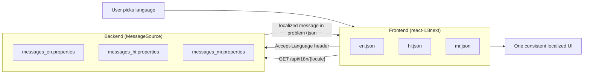
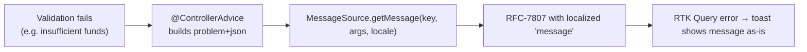

# SecureBank — Internationalization (i18n) Strategy

> How SecureBank speaks **English (`en`)**, **Hindi (`hi`)**, and **Marathi (`mr`)** across the
> *whole* stack — both the React UI and the Spring API. Default locale is `en`. Frontend specifics:
> [frontend/docs/i18n.md](../frontend/docs/i18n.md); fixed contract:
> [PROJECT_SPEC.md](PROJECT_SPEC.md).

---

## 1. Principle: two tiers, one experience

A banking app must be fully localized — not just buttons, but **validation errors, transaction
descriptions, and notification messages**. SecureBank splits the responsibility cleanly:

| Text origin | Owned by | Mechanism |
|---|---|---|
| UI chrome (labels, menus, page copy) | **Frontend** | `react-i18next` bundles |
| Server-authored text (validation, RFC-7807 `message`, notification templates) | **Backend** | Spring `MessageSource` |

They cooperate so the user sees one consistent language everywhere.



## 2. How the two tiers cooperate

1. The user selects a language; the frontend calls `i18n.changeLanguage('hi')` and persists the
   choice (and `users.preferred_locale` server-side).
2. The frontend renders all UI strings from its bundled JSON for that locale.
3. On **every** API request, the frontend sends `Accept-Language: hi`. The backend's
   `LocaleResolver` reads it and `MessageSource` resolves server-authored text in that locale.
4. Server errors come back as RFC-7807 with a `message` already localized to the request locale —
   the UI shows it directly, no client-side translation needed.
5. The endpoint `GET /api/i18n/{locale}` returns the backend's message bundle for a locale, so the
   UI can fetch server-authored strings when it needs them client-side.

```mermaid
sequenceDiagram
  actor U as User
  participant FE as react-i18next
  participant API as API
  participant MS as MessageSource
  U->>FE: choose "mr"
  FE->>FE: changeLanguage('mr'); persist
  FE->>API: GET /api/i18n/mr
  API->>MS: load messages_mr
  MS-->>FE: bundle
  loop every request
    FE->>API: Accept-Language: mr
    API->>MS: resolve text for mr
    MS-->>FE: localized message / problem+json
  end
```

## 3. Notification localization

Notifications are built by the notification service from Kafka events. The template is resolved via
`MessageSource` using the **recipient's `preferred_locale`** (stored on `users`), so a Hindi-
preferring customer gets a Hindi SMS/email even though the triggering event carried no UI context.

## 4. Adding a new language (worked checklist)

Suppose we add Tamil (`ta`):

**Frontend**
1. Add `frontend/src/i18n/locales/ta.json` (copy `en.json`, translate values).
2. Register `ta` in the i18next resources and the language switcher.

**Backend**
1. Add `backend/src/main/resources/i18n/messages_ta.properties` (copy `messages_en`, translate).
2. Add `ta` to the supported-locales config so `LocaleResolver` accepts `Accept-Language: ta` and
   `/api/i18n/ta` resolves.

**Shared**
1. Add `ta` to the allowed values for `users.preferred_locale`.
2. Translate notification templates.
3. Test: switch the UI to `ta`, trigger a validation error, confirm the `message` returns in Tamil.

No code changes are required beyond registration — the architecture is data-driven by locale files.

## 5. How a localized error flows backend → UI



The key insight: **the backend localizes the message, the frontend just displays it.** This keeps
business/error wording in one place (the backend bundles) and avoids duplicating every server error
string in the client.

## 6. Gotchas handled
- **Fallback**: any missing key falls back to `en` (default locale) rather than showing a raw key.
- **Pluralization & interpolation**: react-i18next handles plurals/placeholders client-side;
  `MessageSource` uses `{0}`-style argument substitution server-side.
- **Right-to-left**: not needed for en/hi/mr, but the UI structure leaves room for it.

See the i18n flow in context in
[LLD-overview.md](LLD-overview.md#4-internationalization-flow).
