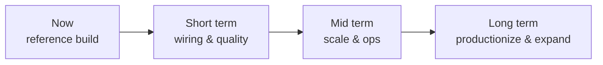
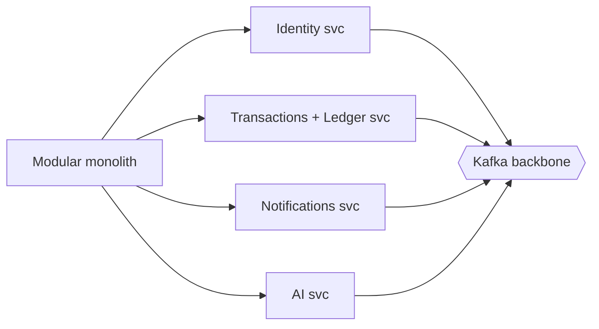

# SecureBank — Roadmap & Production Hardening

> What SecureBank is *not yet*, and the path from reference build to production-grade banking
> platform. This complements the hardening table in [security.md](security.md#8-production-hardening-the-gap-to-real-pci-dss--banking).

---

## Snapshot

SecureBank today is a **complete, correct, well-documented reference system**: real double-entry
money movement, layered locking, event-driven notifications, AI features with deterministic
fallback, full i18n, and a working Docker/K8s/CI pipeline. The roadmap below is the gap to a
deployment a regulator would sign off on.

## Short term — wiring & quality
- **Real LLM key wiring** — connect the AI provider adapter to a live model with a real key
  (currently behind a circuit breaker with a deterministic fallback). Keep the fallback as the
  safety net.
- **More test depth** — expand Testcontainers coverage of concurrent transfers (deadlock,
  lost-update, distributed-lock contention) and contract tests between frontend and backend.
- **Idempotency keys** — accept a client idempotency key on money-movement endpoints so retries are
  provably safe.
- **Refresh-token rotation + reuse detection** — rotate refresh tokens on use and revoke on reuse.

## Mid term — scale & ops
- **Modular-monolith → microservices split** — peel domains (identity, transactions/ledger,
  notifications, AI) into independently deployable services along the existing package seams. See
  [architecture.md](architecture.md#1-architectural-style).

- **Database scaling** — read replicas, then sharding by customer for write throughput on hot
  accounts.
- **Sealed secrets** — move from plain K8s Secrets to Sealed Secrets / external secret managers
  (Vault) with rotation. See [infra/docs/deployment.md](../infra/docs/deployment.md).
- **Blue-green / canary deploys** — zero-downtime releases with automated rollback on SLO breach.
- **mTLS + service mesh** — encrypt and authenticate all service-to-service traffic.
- **Deeper observability** — distributed tracing (OpenTelemetry), SLOs, alerting on the Grafana
  dashboards. See [infra/docs/observability.md](../infra/docs/observability.md).

## Long term — productionize & expand
- **PCI-DSS hardening** — encryption at rest, KMS/HSM key management, tamper-evident audit log,
  WAF, MFA/step-up auth, pen-testing in CI. Full list in [security.md](security.md#8-production-hardening-the-gap-to-real-pci-dss--banking).
- **More locales** — extend beyond en/hi/mr; the i18n design already supports drop-in locale files.
  See [internationalization.md](internationalization.md#4-adding-a-new-language-worked-checklist).
- **Mobile app** — native iOS/Android (or React Native) reusing the same API and i18n bundles.
- **Richer AI** — real-time fraud models, personalized insights, the assistant grounded on the
  customer's own (permissioned) data.
- **Open banking** — outbound payment rails, scheduled/recurring payments, statements export.

## Summary table

| Horizon | Theme | Headline items |
|---|---|---|
| Short | Wiring & quality | Real LLM key, idempotency keys, token rotation, more tests |
| Mid | Scale & ops | Microservices split, DB scaling, sealed secrets, blue-green, mTLS, tracing |
| Long | Productionize & expand | PCI-DSS, more locales, mobile app, richer AI, open banking |
