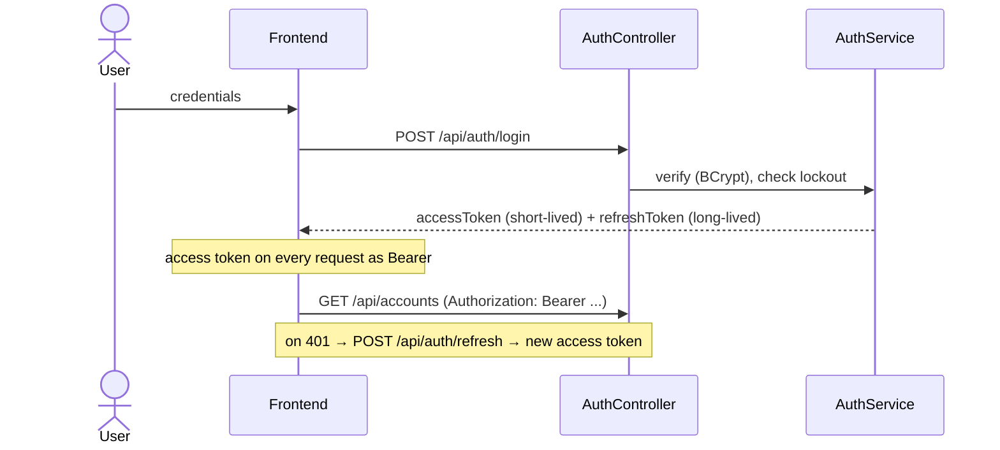
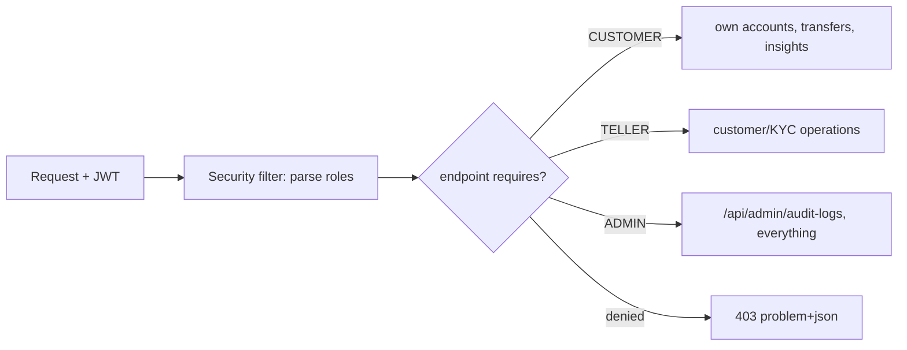
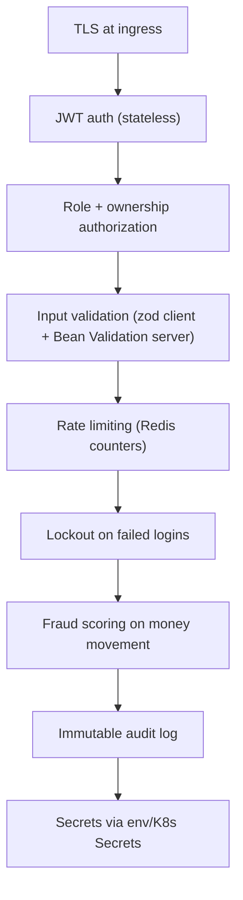

# SecureBank — Security Posture

> The system-level security view: how SecureBank authenticates, authorizes, hashes, handles
> transport/secrets, reports errors, and audits — plus a **production hardening** section listing
> what a real PCI-DSS / banking deployment would add. Backend specifics live in
> [backend-LLD](../backend/docs/backend-LLD.md); the fixed contract is
> [PROJECT_SPEC.md](PROJECT_SPEC.md).

---

## 1. Authentication — JWT access + refresh



- **Access token**: short-lived JWT, issuer `securebank`, carries subject + roles. Sent as
  `Authorization: Bearer` on every request and validated by a stateless security filter.
- **Refresh token**: long-lived, used only at `/api/auth/refresh` to mint a new access token, so a
  leaked access token has a small blast radius.
- **Stateless**: no server session — the API scales horizontally because each node validates the
  token independently.

## 2. Authorization — roles

Three roles gate access: `CUSTOMER`, `TELLER`, `ADMIN`.



- Method/endpoint authorization enforces least privilege, e.g. `/api/admin/audit-logs` is
  `ADMIN`-only.
- Ownership checks ensure a `CUSTOMER` can only see *their own* accounts/transactions, not just any
  authenticated user's.

## 3. Password hashing + account lockout

- Passwords are stored only as **BCrypt** hashes in `users.password_hash` (salted, adaptive work
  factor) — never plaintext, never reversible.
- **Lockout**: `failed_attempts` increments on each bad password; past a threshold `locked_until`
  is set, and login is refused (HTTP 423) until it expires. This throttles brute-force/credential-
  stuffing.
- Successful login resets `failed_attempts`.

## 4. Transport & secrets handling

- **Transport**: TLS terminates at the ingress; all browser↔API and (in production) service↔service
  traffic is encrypted. Local dev uses HTTP for convenience only.
- **Secrets**: DB/Redis/Kafka/JWT-signing/AI-key are injected via environment variables backed by
  **Kubernetes Secrets** (and `.env` locally) — never committed to source. See
  [infra/docs/deployment.md](../infra/docs/deployment.md).
- **Demo credentials** (`admin` / `customer`, `Password123!`) are seeded for local use only and
  must never reach a shared environment.

## 5. Error reporting — RFC-7807

All errors return `application/problem+json` with a stable shape and a **localized `message`**
selected by the request's `Accept-Language` (en/hi/mr — see
[internationalization.md](internationalization.md)).

```json
{
  "type": "https://securebank/errors/insufficient-funds",
  "title": "Insufficient funds",
  "status": 422,
  "detail": "Balance is lower than the requested amount",
  "message": "अपर्याप्त शेष राशि",
  "instance": "/api/transactions/transfer"
}
```

This gives the frontend a predictable, machine-readable error contract while showing the user text
in their language. Internal details (stack traces, SQL) are never leaked to clients.

## 6. Audit logging

Every state change appends an immutable row to `audit_logs` (actor, action, entity_type,
entity_id, JSONB details, timestamp). Rows are append-only — never updated or deleted — so the bank
can reconstruct *who did what, when* after the fact. Admins read them via `/api/admin/audit-logs`
(searchable via JPA Specifications).

## 7. Defense in depth (summary)



---

## 8. Production hardening (the gap to "real" PCI-DSS / banking)

SecureBank models banking-grade practices but is a reference build. A genuine production deployment
would add:

| Area | Hardening |
|---|---|
| **Encryption at rest** | Encrypt Postgres volumes and backups; column-level encryption for PII/PAN; encrypted Redis persistence. |
| **Key management & rotation** | Move JWT signing + DB/AI secrets into a KMS/HSM (e.g. Vault); automatic rotation; short-lived dynamic DB credentials. |
| **mTLS** | Mutual TLS for all service-to-service traffic (service mesh), not just edge TLS. |
| **Token hardening** | Asymmetric (RS/ES) JWT signing, key rotation via JWKS, refresh-token rotation + reuse detection, server-side revocation list. |
| **Fraud monitoring** | Real-time anomaly detection, velocity rules, device fingerprinting, step-up auth / 3-D Secure style challenges. |
| **MFA** | TOTP / WebAuthn for login and high-risk actions. |
| **Network controls** | WAF, strict CORS, security headers (CSP, HSTS), private subnets, no public DB. |
| **Compliance** | PCI-DSS scope reduction (tokenize/vault card data), SoD, change management, pen-testing, SAST/DAST in CI, dependency scanning. |
| **Audit integrity** | Tamper-evident audit log (hash-chaining / WORM storage), centralized SIEM, alerting. |
| **Data lifecycle** | PII minimization, retention/erasure policy (GDPR/DPDP), data residency. |
| **Resilience** | Multi-AZ/region, automated failover, tested DR, rate-limited and DDoS-protected edge. |

These items appear on the [roadmap](roadmap.md) as the path from reference build to production.
