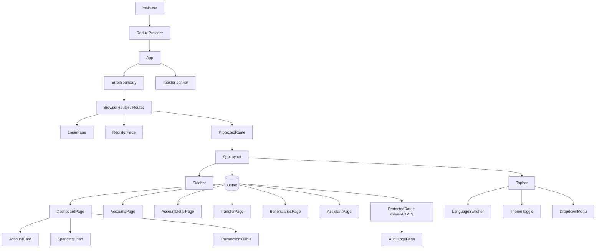
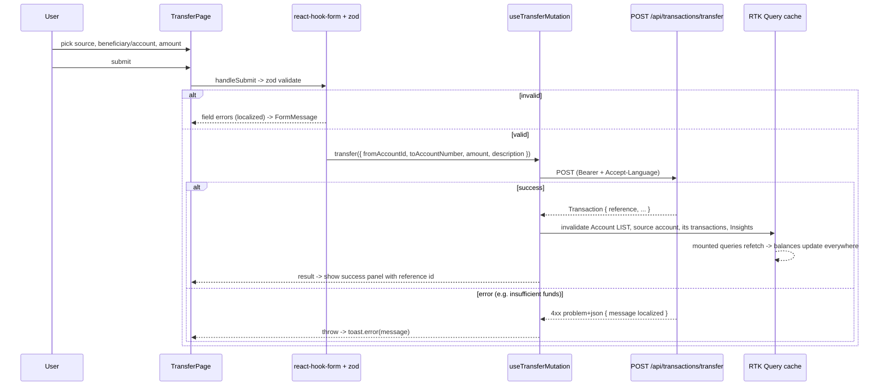

# SecureBank Frontend — Low-Level Design

Component-level design: the component tree, what the key components do, and a complete
walkthrough of the money-transfer flow.

## Component tree



## Key components

### `App.tsx`
Owns the router, the top-level `ErrorBoundary`, and the global `Toaster`. Route tree:
public (`/login`, `/register`) and a protected branch wrapped by `ProtectedRoute` →
`AppLayout`. The admin page sits behind a second, role-scoped `ProtectedRoute`.

### `ProtectedRoute`
A layout route. Reads `useAuth()`. If not authenticated → `<Navigate to="/login">`
carrying the attempted location so we can return there post-login. If a `roles` prop is
set and the user lacks the role → redirect to `/`. Otherwise renders `<Outlet/>`.

### `AppLayout` / `Sidebar` / `Topbar`
The authenticated shell. `Sidebar` and the mobile `Sheet` both render `NavLinks` from a
single `NAV_ITEMS` array (admin items filtered by role). `Topbar` holds the language
switcher, theme toggle, and the user menu (logout clears the session **and** resets the
RTK Query cache so the next user starts clean).

### `services/api.ts`
The RTK Query api. Defines every endpoint, the tag graph, and the re-auth base query.
See `state-management.md`.

### Shared widgets
- `AccountCard` — balance summary, links to detail.
- `TransactionsTable` — reused on dashboard + account detail; signs/colors amounts.
- `SpendingChart` — recharts donut from `/insights/spending`.
- `Money` — locale + currency formatting via `Intl.NumberFormat`.
- `StatusBadge` — maps domain status → colored badge.
- `States` — `EmptyState` / `ErrorState` (with retry).

## The transfer flow, end to end

The transfer is the most important flow; here is what happens from click to refreshed
balances.



### Step detail

1. **Inputs** — `TransferPage` loads accounts (source dropdown) and beneficiaries.
   Selecting a beneficiary fills `toAccountNumber`; the user can also type one.
2. **Validation (zod)** — source required, destination required, amount must be a
   positive number with ≤ 2 decimals, and a cross-field `refine` forbids sending to the
   same account. Messages come from i18n keys so they localize live.
3. **Submit** — `transfer(...).unwrap()` throws on error, so we `try/catch` and surface
   the backend's localized RFC-7807 `message` through a toast.
4. **Cache invalidation** — the mutation's `invalidatesTags` marks the account list,
   the source account, its transaction list, and insights stale. Every mounted query
   providing those tags refetches. This is why the dashboard's balances and the
   account detail update without any manual refetch — that's our "optimistic UX".
5. **Confirmation** — on success the page swaps to a success panel showing the
   server-issued `reference`. "New transfer" resets back to the form.

## Loading & error conventions

Every data section follows the same three-state pattern:

```tsx
{isLoading ? <Skeleton/> : isError ? <ErrorState message={...} onRetry={refetch}/> : <Data/>}
```

Empty (success but no rows) renders `<EmptyState/>` with a relevant call to action.
