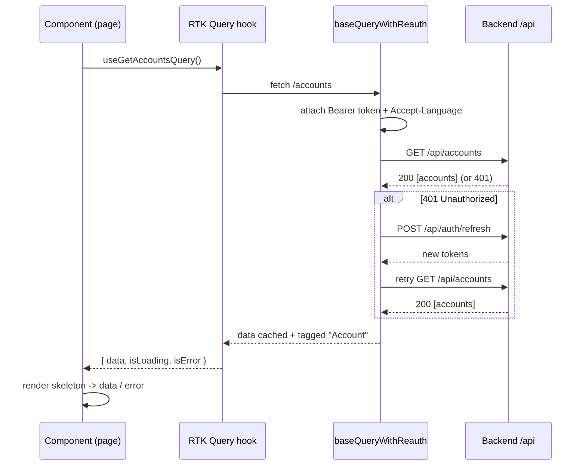

# SecureBank Frontend — Architecture

This document explains how the frontend is organized, how data flows from a component
to the backend and back, and the render lifecycle of a typical page. It is written for
an engineer who is new to the codebase.

## Tech stack

| Concern | Choice |
|---|---|
| Framework | React 18 + TypeScript 5 |
| Bundler / dev server | Vite |
| State & data fetching | Redux Toolkit + RTK Query |
| UI components | shadcn/ui primitives on Tailwind CSS |
| Routing | react-router-dom v6 |
| Forms & validation | react-hook-form + zod |
| i18n | react-i18next (en / hi / mr) |
| Charts | recharts |
| Tests | Vitest + React Testing Library |

## Folder structure

```
frontend/
├── index.html               # Vite entry HTML
├── vite.config.ts           # @ alias, port 5173, /api proxy -> :8080
├── tailwind.config.js       # maps Tailwind colors -> CSS variables
├── components.json          # shadcn config
├── Dockerfile / nginx.conf  # multi-stage build, SPA + API proxy
├── docs/                    # this folder
└── src/
    ├── main.tsx             # entry: Provider + i18n + render
    ├── App.tsx              # router + error boundary + toaster
    ├── index.css            # design tokens (light/dark CSS variables)
    ├── app/
    │   ├── store.ts         # configureStore (auth slice + api reducer/middleware)
    │   └── hooks.ts         # typed useAppDispatch / useAppSelector
    ├── services/
    │   ├── api.ts           # RTK Query api: baseQuery, re-auth, endpoints, tags
    │   └── mutex.ts         # async mutex for the single-refresh re-auth flow
    ├── features/auth/
    │   └── authSlice.ts     # JWT session + current user (persisted to localStorage)
    ├── types/index.ts       # all DTO TypeScript interfaces
    ├── i18n/
    │   ├── index.ts         # react-i18next init + LanguageDetector
    │   └── locales/{en,hi,mr}/translation.json
    ├── hooks/               # useAuth, useTheme
    ├── lib/                 # utils (cn, money/date formatting), errors
    ├── components/
    │   ├── ui/              # shadcn primitives (button, card, dialog, ...)
    │   ├── layout/          # AppLayout, Sidebar, Topbar
    │   └── *.tsx            # shared widgets (AccountCard, TransactionsTable, ...)
    ├── pages/               # one component per route
    └── test/setup.ts        # vitest/jsdom setup
```

## Layered responsibilities

- **pages/** — route-level screens. They orchestrate data (call RTK Query hooks) and
  compose shared components. They contain no networking logic of their own.
- **components/** — presentational + small stateful widgets reused across pages.
  `components/ui` are the design-system primitives.
- **services/api.ts** — the single networking boundary. Nothing else issues fetches.
- **features/** & **app/** — Redux state (the auth session and the RTK Query cache).
- **lib/** & **hooks/** — pure helpers and reusable React hooks.

## Data flow: component → RTK Query → backend



Key idea: components never touch fetch/axios. They call a generated hook and read
`{ data, isLoading, isError, error }`. Caching, de-duplication, and refetch-after-write
are handled by RTK Query tags (see `state-management.md`).

## Render lifecycle of a page

1. `main.tsx` mounts `<Provider store>` → `<App>`. i18n is initialized as a side effect
   before the first render.
2. `App.tsx` sets up the router. `ProtectedRoute` checks the auth slice: unauthenticated
   users are redirected to `/login`.
3. The matched page mounts and calls its RTK Query hooks. On first mount the data is not
   cached, so hooks return `isLoading: true` → the page renders **skeletons**.
4. When the request resolves, the hook re-renders the component with `data`, or with
   `isError`/`error` (which we turn into a localized message via `lib/errors.ts`).
5. A write (e.g. a transfer) invalidates tags; any mounted query providing those tags
   refetches automatically, re-rendering the affected components with fresh data.

## Why the /api proxy (not absolute URLs)

All API calls use the relative path `/api/...`. In development Vite proxies `/api` to
`http://localhost:8080`; in production nginx proxies it to the backend service. This
keeps the frontend code free of environment-specific base URLs and avoids CORS.
