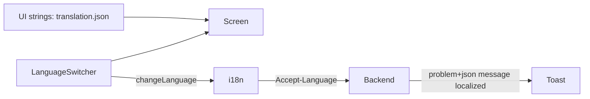

# SecureBank Frontend — Internationalization (i18n)

SecureBank ships in English (`en`), Hindi (`hi`), and Marathi (`mr`). Internationalization
spans **both** layers: the frontend translates its own UI strings, and the backend
localizes its messages/validation/errors. They cooperate so the user sees one consistent
language everywhere.

## How react-i18next is wired

`src/i18n/index.ts`:

- Bundles the three locale JSON files statically (`resources`), so the UI translates
  instantly and works offline.
- Uses **`i18next-browser-languagedetector`** to pick the initial language:
  `localStorage` → `navigator.language` → `<html lang>`, falling back to `en`.
- Persists the chosen language to `localStorage` under `securebank.lang`, so a returning
  user keeps their choice.
- `load: "languageOnly"` + `nonExplicitSupportedLngs` collapse region variants like
  `en-US` to the base `en`, matching our three bundles.
- `escapeValue: false` because React already escapes rendered values (avoids double
  encoding).

`main.tsx` imports `@/i18n` for its initialization side effect before the app renders.
Components read translations with the `useTranslation()` hook:

```tsx
const { t, i18n } = useTranslation();
t("dashboard.greeting", { name }); // interpolation
i18n.changeLanguage("hi");          // switch language app-wide
```

## The language switcher

`components/LanguageSwitcher.tsx` is a shadcn `Select` showing `English / हिन्दी / मराठी`.
Selecting a language calls `i18n.changeLanguage(lng)`, which:

1. Re-renders every component using `t(...)` with the new strings.
2. Persists the choice (via the detector's localStorage cache).
3. Changes what subsequent API requests send as `Accept-Language` (see below).

## Translation file structure

`src/i18n/locales/{en,hi,mr}/translation.json` share the same nested key namespaces:

```
app, nav, common, theme, language, auth (+ auth.validation),
dashboard, accounts (+ type/status), transactions (+ type/status),
transfer (+ validation), beneficiaries (+ validation), insights,
assistant (+ suggestions), audit, errors
```

The Hindi and Marathi files are real Devanagari translations, not placeholders.

## How frontend + backend i18n cooperate

The single most important line is in `services/api.ts`:

```ts
headers.set("accept-language", i18n.language || "en");
```

Every API call carries the user's current UI language as `Accept-Language`. The backend
(per the spec) returns RFC-7807 error responses with a `message` localized to that
header. `lib/errors.ts` then surfaces that `message` in a toast — so a validation error
or "insufficient funds" message appears in the same language as the surrounding UI.



Some content is localized **only** on the backend and rendered as-is: the spending
**insights summary** and the **assistant** answers are natural-language text generated
server-side using `Accept-Language`. The frontend just displays them.

## Adding a new language (e.g. Tamil `ta`)

1. Create `src/i18n/locales/ta/translation.json` (copy `en` and translate every value).
2. In `src/i18n/index.ts`:
   - import the new JSON,
   - add it to `resources`,
   - add `"ta"` to `SUPPORTED_LOCALES`,
   - add a label to `LOCALE_LABELS`.
3. That's it — the switcher renders the new option automatically and the backend must
   support the same locale for end-to-end localization (the spec fixes `en/hi/mr`, so a
   new locale also requires a backend message bundle).

## Locale-aware formatting

Money and dates are not translated strings — they're formatted with `Intl` using
`i18n.language` (see `lib/utils.ts`): `formatMoney`, `formatDate`, `formatDateTime`.
This gives correct grouping separators, digit shaping, and date order per locale.
