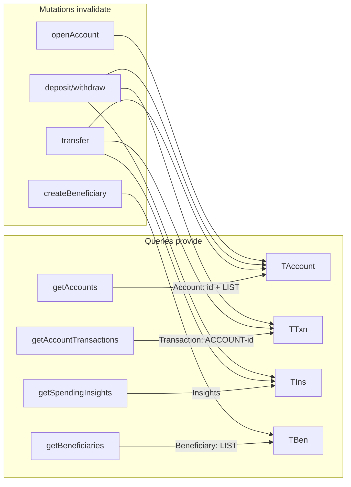
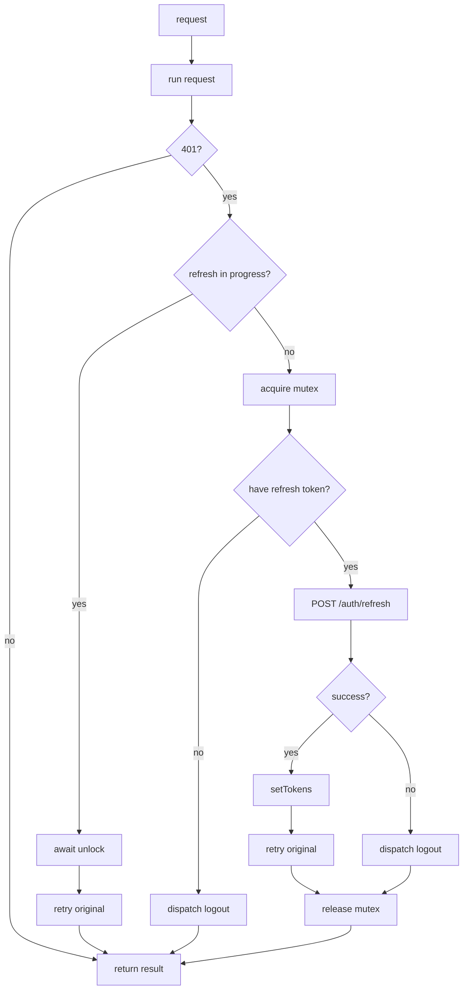

# SecureBank Frontend — State Management

State is split into two clearly separated kinds:

1. **Session state** — the JWT pair and the current user. Hand-written Redux slice
   (`features/auth/authSlice.ts`), persisted to `localStorage`.
2. **Server cache state** — everything fetched from the API. Owned entirely by RTK
   Query (`services/api.ts`). We never copy server data into our own slices.

Component-local UI state (dialog open/closed, chat input, the in-progress transfer
result) stays in `useState` — it is presentation, not shared data.

## The store

```ts
configureStore({
  reducer: { auth: authReducer, [api.reducerPath]: api.reducer },
  middleware: (getDefault) => getDefault().concat(api.middleware),
});
```

`api.middleware` is mandatory: it powers caching, invalidation, polling, and the
lifecycle of every endpoint. `setupListeners` enables refetch-on-focus/reconnect.

Typed helpers `useAppDispatch` / `useAppSelector` (in `app/hooks.ts`) give full
`RootState` typing at every call site — no `any`.

## Auth slice

| Reducer | When | Effect |
|---|---|---|
| `setCredentials` | after login/register | stores tokens + user, persists |
| `setTokens` | after a silent refresh | replaces just the tokens |
| `logout` | manual or dead refresh token | clears state + localStorage |

On boot the slice hydrates from `localStorage` so a page reload keeps the user signed
in. (Redux state itself is in-memory and wiped on reload.)

> Security note: storing the refresh token in `localStorage` is convenient and fine for
> this project, but it is readable by any script on the page. A hardened deployment
> would keep the refresh token in an `httpOnly` cookie and only the short-lived access
> token in memory. The trade-off is more backend/cookie plumbing.

## RTK Query: endpoints

`services/api.ts` defines the full API surface from the spec: auth
(register/login/refresh), `customers/me`, accounts (list/get/open/transactions),
transactions (deposit/withdraw/transfer/by-reference), beneficiaries (list/create),
`insights/spending`, `assistant/ask`, and admin `audit-logs`. Each generates a typed
hook (`useGetAccountsQuery`, `useTransferMutation`, …).

## Tags & invalidation (the important part)

Tags are how a write makes the right reads refresh. A **query** *provides* tags; a
**mutation** *invalidates* tags. When they overlap, RTK Query refetches the affected
queries automatically.



Concrete example — **a transfer**:

```ts
invalidatesTags: (_r, _e, arg) => [
  { type: "Account", id: "LIST" },                       // all balances
  { type: "Account", id: arg.fromAccountId },            // the source account
  { type: "Transaction", id: `ACCOUNT-${arg.fromAccountId}` }, // its history
  "Insights",                                            // spending changes
]
```

Because the dashboard mounts `getAccounts`, after a transfer those tags go stale and
the dashboard balances refetch with zero manual wiring. This is the mechanism behind
"balances refresh after a transfer".

## The re-auth (refresh-on-401) flow

`baseQueryWithReauth` wraps the raw `fetchBaseQuery`:



Why the mutex (`services/mutex.ts`): if several requests 401 at once, only **one**
`/auth/refresh` should fire. The rest wait on the mutex, then retry with the new token.
Without it we'd send concurrent refreshes and could rotate the refresh token out from
under in-flight requests.

The access token and `Accept-Language` are attached in `prepareHeaders`, reading the
auth slice and the live `i18n.language` respectively — so every request is both
authenticated and localized.

## Cache reset on logout

`logout()` clears the slice; we also dispatch `api.util.resetApiState()` so the next
user who signs in on the same browser never sees the previous user's cached data.
