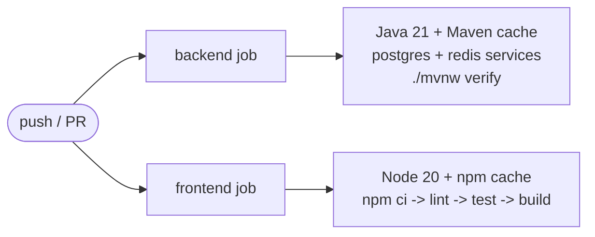
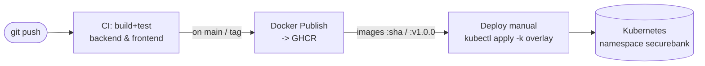

# CI/CD guide (SecureBank)

GitHub Actions workflows live in **`.github/workflows/`**:

| Workflow             | File                  | Trigger                          | What it does                                  |
|----------------------|-----------------------|----------------------------------|-----------------------------------------------|
| **CI**               | `ci.yml`              | every push & PR to `main`        | build + test backend (Java 21) and frontend (Node), in parallel |
| **Docker Publish**   | `docker-publish.yml`  | push to `main`, tags `v*`        | build & push backend + frontend images to GHCR |
| **Deploy**           | `deploy.yml`          | manual (`workflow_dispatch`)     | `kubectl apply -k` an overlay (gated template) |

---

## 1. CI (`ci.yml`)

Two **independent jobs** run in parallel:



### Backend job
- `actions/setup-java@v4` with `distribution: temurin`, `java-version: 21`,
  `cache: maven` (caches `~/.m2`).
- Spins up **Postgres 16** and **Redis 7** as service containers with
  healthchecks, and exports `SPRING_DATASOURCE_*` / `SPRING_DATA_REDIS_*` env so
  integration tests have a real DB/cache. (Testcontainers-based tests also work —
  the runner has Docker available.)
- Runs `./mvnw -B --no-transfer-progress verify` (compile + unit + integration +
  any verify-phase checks).
- Uploads surefire reports as an artifact (even on failure).

### Frontend job
- `actions/setup-node@v4`, Node 20, `cache: npm` keyed on `frontend/package-lock.json`.
- `npm ci` → `npm run lint` → `npm run test` (Vitest) → `npm run build` (Vite).
- Uploads `frontend/dist` as an artifact.

`concurrency` cancels superseded runs on the same ref to save minutes.

### Required secrets
**None.** CI uses only the built-in runner. (If your tests call an external AI
provider, add `AI_API_KEY` as a secret and wire it into the backend job env.)

---

## 2. Docker Publish (`docker-publish.yml`)

Builds and pushes **both** images via a matrix (backend + frontend run in
parallel), using buildx with **GitHub Actions layer cache** (`type=gha`).

Images pushed to **GHCR**:
```
ghcr.io/247software-malhar-jadhav/securebank-backend
ghcr.io/247software-malhar-jadhav/securebank-frontend
```

### Tags produced (via `docker/metadata-action`)
- the branch name (e.g. `main`)
- the git tag on tag pushes (e.g. `v1.0.0`)
- a short commit SHA (e.g. `sha-1a2b3c4`) — good for immutable deploys
- `latest` — only when building from `main`

### Auth — no PAT needed
Login uses the built-in `GITHUB_TOKEN` with `permissions: packages: write`
declared in the workflow. That token can push to GHCR packages owned by the repo.

### GHCR one-time setup
1. The first successful push **creates** the package under the owner
   `247software-malhar-jadhav`.
2. To allow the Kubernetes cluster to pull without auth, make each package
   **public**: GitHub → your profile/org → Packages → `securebank-backend` →
   Package settings → Change visibility → Public. (Repeat for `-frontend`.)
   - For **private** packages, create an image pull secret in the cluster:
     ```bash
     kubectl -n securebank create secret docker-registry ghcr-pull \
       --docker-server=ghcr.io \
       --docker-username=<github-username> \
       --docker-password=<a-PAT-with-read:packages> \
       --docker-email=you@example.com
     ```
     then add `imagePullSecrets: [{name: ghcr-pull}]` to the pod specs (or the
     namespace default service account).
3. Link the package to the repo (Package settings → "Connect repository") so the
   `GITHUB_TOKEN` is authorized to push.

### Trigger it
- Push to `main` → builds + pushes `:main`, `:sha-...`, `:latest`.
- Push a tag: `git tag v1.0.0 && git push origin v1.0.0` → builds + pushes
  `:v1.0.0`, `:sha-...`.

---

## 3. Deploy (`deploy.yml`) — gated template

This is a **manual, opt-in** template. It does not run on push. It:
1. checks out the repo,
2. installs `kubectl`,
3. writes a kubeconfig from the `KUBE_CONFIG` secret,
4. server-side dry-runs, then `kubectl apply -k infra/k8s/overlays/<overlay>`,
5. waits for the backend + frontend rollouts.

### Required secret
- **`KUBE_CONFIG`** — a **base64-encoded** kubeconfig, ideally scoped via RBAC to
  the `securebank` namespace only:
  ```bash
  base64 -w0 ~/.kube/config        # copy the output into the secret
  # macOS: base64 -i ~/.kube/config | tr -d '\n'
  ```
  Add it: GitHub → repo → Settings → Secrets and variables → Actions → New secret.

### Trigger it
GitHub → **Actions** tab → **Deploy** → **Run workflow** → choose `dev` or `prod`.

### Hardening for real use
- Uncomment the `environment: ${{ inputs.overlay }}` line and configure a
  **protected GitHub Environment** with required reviewers for `prod`.
- Pin image tags in the prod overlay to the immutable `:v1.0.0` / `:sha-...` tag
  that Docker Publish produced — never deploy `:latest` to prod.
- Prefer a GitOps tool (**Argo CD** / **Flux**) over push-based `kubectl apply`
  for production: commit the desired state, let the controller reconcile.

---

## 4. End-to-end pipeline



## 5. Secrets checklist

| Secret         | Used by              | Required?                         |
|----------------|----------------------|-----------------------------------|
| `GITHUB_TOKEN` | docker-publish       | built-in (no action needed)       |
| `KUBE_CONFIG`  | deploy               | only if you enable Deploy         |
| `AI_API_KEY`   | (optional) CI tests  | only if tests hit the AI provider |
