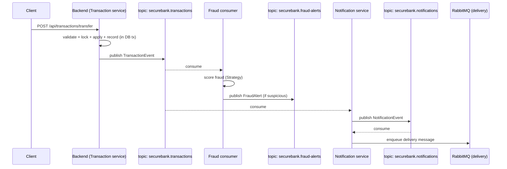

# Kafka guide (SecureBank)

Kafka is SecureBank's **event backbone** — the asynchronous "nervous system" that
lets the money-movement code publish a fact ("a transaction happened") without
caring who reacts to it. This is the **Observer / Pub-Sub** pattern from the spec.

All commands are copy-pasteable. From the host you reach Kafka at
`localhost:9092`; **inside** a container you use `kafka:29092` (compose) /
`kafka:9092` (k8s).

---

## 1. What Kafka does here



Key idea: the HTTP request returns as soon as the DB transaction commits and the
event is published. Fraud scoring and notifications happen **off the request
path**, so the API stays fast.

---

## 2. Topics & event schemas

The three topics are **fixed by the spec** and created automatically (the
`kafka-init` compose container / the `kafka-init-topics` k8s Job).

| Topic                       | Produced by            | Consumed by            | Meaning                              |
|-----------------------------|------------------------|------------------------|--------------------------------------|
| `securebank.transactions`   | Transaction service    | Fraud + Notification   | A money movement was recorded        |
| `securebank.fraud-alerts`   | Fraud service          | Notification / Audit   | A transaction was flagged            |
| `securebank.notifications`  | Notification service   | Notification dispatcher| A user-facing alert to be delivered  |

**Indicative event payloads** (JSON; the backend uses these shapes — confirm
exact fields against the backend code, money is always a string `BigDecimal`):

`securebank.transactions`
```json
{
  "eventId": "f1c2...",
  "reference": "TXN-20260619-0001",
  "accountId": 1,
  "counterpartyAccountId": 2,
  "type": "TRANSFER",
  "amount": "250.0000",
  "currency": "INR",
  "balanceAfter": "750.0000",
  "status": "COMPLETED",
  "occurredAt": "2026-06-19T10:15:30Z"
}
```

`securebank.fraud-alerts`
```json
{
  "eventId": "9ab3...",
  "transactionReference": "TXN-20260619-0001",
  "accountId": 1,
  "score": 0.87,
  "decision": "REVIEW",
  "reasons": ["amount>3x_avg", "new_beneficiary"],
  "occurredAt": "2026-06-19T10:15:31Z"
}
```

`securebank.notifications`
```json
{
  "eventId": "44de...",
  "userId": 10,
  "channel": "EMAIL",
  "locale": "en",
  "template": "TRANSACTION_ALERT",
  "params": { "amount": "250.0000", "reference": "TXN-20260619-0001" },
  "occurredAt": "2026-06-19T10:15:31Z"
}
```

---

## 3. Start it

Kafka starts as part of the full stack:

```bash
cd infra
docker compose up -d
```

To start just the messaging dependencies:

```bash
docker compose up -d zookeeper kafka kafka-init
```

Verify the broker is healthy:

```bash
docker compose ps kafka
docker compose exec kafka kafka-broker-api-versions --bootstrap-server localhost:9092 >/dev/null && echo "broker OK"
```

---

## 4. List & describe topics

```bash
# List topics
docker compose exec kafka kafka-topics --bootstrap-server localhost:9092 --list

# Describe one (partitions, replication, leaders)
docker compose exec kafka kafka-topics --bootstrap-server localhost:9092 \
  --describe --topic securebank.transactions
```

Create a topic manually (normally not needed — `kafka-init` does it):

```bash
docker compose exec kafka kafka-topics --bootstrap-server localhost:9092 \
  --create --if-not-exists --topic securebank.transactions \
  --partitions 3 --replication-factor 1
```

---

## 5. Inspect events: consume

Watch transaction events live (run this in one terminal, then trigger a deposit
from `running-with-docker.md` §5 in another):

```bash
docker compose exec kafka kafka-console-consumer \
  --bootstrap-server localhost:9092 \
  --topic securebank.transactions \
  --from-beginning \
  --property print.key=true \
  --property key.separator=" | "
```

Notifications:

```bash
docker compose exec kafka kafka-console-consumer \
  --bootstrap-server localhost:9092 \
  --topic securebank.notifications --from-beginning
```

Fraud alerts:

```bash
docker compose exec kafka kafka-console-consumer \
  --bootstrap-server localhost:9092 \
  --topic securebank.fraud-alerts --from-beginning
```

---

## 6. Produce a test event (manually)

Useful to exercise the notification path without going through the API:

```bash
docker compose exec -i kafka kafka-console-producer \
  --bootstrap-server localhost:9092 \
  --topic securebank.notifications \
  --property "parse.key=true" --property "key.separator=:"
```

Then type (one message per line, Ctrl-D to finish):

```
10:{"eventId":"test-1","userId":10,"channel":"EMAIL","locale":"en","template":"TRANSACTION_ALERT","params":{"amount":"99.0000","reference":"TXN-TEST"},"occurredAt":"2026-06-19T10:00:00Z"}
```

The notification consumer should pick it up and forward it to RabbitMQ (see
`rabbitmq-guide.md`).

---

## 7. Consumer groups & lag

```bash
# List consumer groups (the backend registers groups per listener)
docker compose exec kafka kafka-consumer-groups --bootstrap-server localhost:9092 --list

# Inspect lag for a group (replace with the real group id from the list)
docker compose exec kafka kafka-consumer-groups --bootstrap-server localhost:9092 \
  --describe --group securebank-notifications
```

`CURRENT-OFFSET` vs `LOG-END-OFFSET` shows how far behind a consumer is. Growing
`LAG` means consumers can't keep up.

---

## 8. kafka-ui (web UI)

```bash
docker compose --profile observability up -d kafka-ui
# open http://localhost:8082
```

In kafka-ui you can browse topics, view messages (with JSON formatting), inspect
consumer-group lag, and even produce test messages from the browser.

---

## 9. The transaction → notification flow (recap)

1. `POST /api/transactions/*` commits the DB transaction (with locking).
2. Backend publishes to `securebank.transactions`.
3. Fraud consumer scores it; if risky, publishes to `securebank.fraud-alerts`.
4. Notification consumer turns the event into a localized notification and
   publishes to `securebank.notifications`.
5. The notification dispatcher consumes that and **hands it to RabbitMQ** for
   actual delivery (email/SMS/push) — Kafka = events, RabbitMQ = work queue.

---

## 10. Common errors

| Error                                                              | Cause / fix                                                                                  |
|-------------------------------------------------------------------|----------------------------------------------------------------------------------------------|
| `Connection to node -1 could not be established`                   | Wrong bootstrap. Host tools use `localhost:9092`; containers use `kafka:29092`.               |
| Host client connects then immediately disconnects                 | `advertised.listeners` mismatch — make sure you use the EXTERNAL listener (`localhost:9092`). |
| `UNKNOWN_TOPIC_OR_PARTITION`                                       | Topic not created. `kafka-init` may have failed; re-run `docker compose up -d kafka-init`.    |
| Consumer reads nothing                                             | You're on a new group with `auto.offset.reset=latest`; add `--from-beginning`.               |
| Kafka won't start, exits quickly                                  | Zookeeper not healthy yet, or stale volume. `docker compose logs zookeeper kafka`.           |
| `LEADER_NOT_AVAILABLE` right after start                          | Transient while the broker registers; retry after a few seconds.                             |
