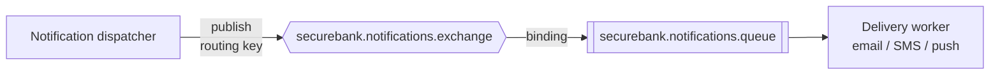

# RabbitMQ guide (SecureBank)

RabbitMQ is the **notification delivery work queue**. Kafka carries *events*
("something happened"); RabbitMQ carries *work* ("please deliver this
notification"). The notification dispatcher consumes the final Kafka
notification event and hands the actual delivery job to RabbitMQ, where a worker
picks it up and sends the email/SMS/push.

Fixed by the spec:

- Exchange: **`securebank.notifications.exchange`**
- Queue: **`securebank.notifications.queue`**
- AMQP port `5672`, management UI `15672` (user/pass `securebank` locally).

From the host: AMQP `localhost:5672`, UI <http://localhost:15672>. Inside the
network the host is `rabbitmq`.

---

## 1. Exchange / queue / binding

The backend (Spring AMQP) declares these on startup, so they exist as soon as the
backend has connected once.



A typical setup is a **direct** or **topic** exchange bound to the queue with a
routing key like `notification.email`. Confirm the exact exchange type and
routing key in the backend's AMQP config; the management UI (below) shows them
live.

---

## 2. Start it

```bash
cd infra
docker compose up -d rabbitmq
# or full stack:
docker compose up -d
```

Verify:

```bash
docker compose ps rabbitmq
docker compose exec rabbitmq rabbitmq-diagnostics -q ping     # -> Ping succeeded
```

---

## 3. Management UI (port 15672)

Open <http://localhost:15672> and log in with `securebank` / `securebank`
(from `.env`). You can:

- **Queues** tab → see `securebank.notifications.queue`, message counts, rates.
- **Exchanges** tab → see `securebank.notifications.exchange` and its bindings.
- **Get messages** (on a queue) → peek/ack messages for debugging.
- **Publish message** (on an exchange) → send a test message.
- **Connections / Channels** → confirm the backend is connected.

---

## 4. End-to-end: see a notification delivered

```bash
# 1. Watch the queue depth
watch -n1 "docker compose exec -T rabbitmq rabbitmqctl list_queues name messages messages_ready messages_unacknowledged"

# 2. In another terminal, trigger a transaction (see running-with-docker.md §5).
#    The Kafka notification event -> dispatcher -> RabbitMQ -> worker consumes it.
#    You should see 'messages' tick up then back to 0 as the worker acks.
```

---

## 5. Inspect queues from the CLI

```bash
# List queues with depth + consumer count
docker compose exec rabbitmq rabbitmqctl list_queues name messages consumers

# List exchanges
docker compose exec rabbitmq rabbitmqctl list_exchanges name type

# List bindings (which routing keys feed the queue)
docker compose exec rabbitmq rabbitmqctl list_bindings

# Connections (is the backend attached?)
docker compose exec rabbitmq rabbitmqctl list_connections name user state
```

---

## 6. Publish a test message

### Via the management HTTP API (no extra tools)

```bash
curl -s -u securebank:securebank \
  -H 'content-type: application/json' \
  -X POST http://localhost:15672/api/exchanges/%2f/securebank.notifications.exchange/publish \
  -d '{
        "properties": {"content_type":"application/json"},
        "routing_key": "notification.email",
        "payload": "{\"userId\":10,\"channel\":\"EMAIL\",\"template\":\"TRANSACTION_ALERT\",\"params\":{\"amount\":\"99.0000\",\"reference\":\"TXN-TEST\"}}",
        "payload_encoding": "string"
      }'
# {"routed":true}  means it matched a binding and landed in the queue
```

> `%2f` is the URL-encoded default vhost `/`. Adjust `routing_key` to match the
> backend's binding (check the Exchanges tab if `"routed":false`).

### Peek a message back off the queue (management API)

```bash
curl -s -u securebank:securebank \
  -H 'content-type: application/json' \
  -X POST http://localhost:15672/api/queues/%2f/securebank.notifications.queue/get \
  -d '{"count":5,"ackmode":"ack_requeue_true","encoding":"auto"}' | jq
```

`ack_requeue_true` puts the message back after peeking (non-destructive).

---

## 7. Purge a queue

```bash
# CLI
docker compose exec rabbitmq rabbitmqctl purge_queue securebank.notifications.queue

# or in the UI: Queues -> securebank.notifications.queue -> "Purge Messages"
```

Useful when a backlog of test messages built up.

---

## 8. Common errors

| Symptom                                                    | Cause / fix                                                                                  |
|------------------------------------------------------------|----------------------------------------------------------------------------------------------|
| Backend: `Connection refused` to RabbitMQ                  | Use host `rabbitmq` (in-container), not `localhost`. Compose sets this. Also wait for healthy.|
| `ACCESS_REFUSED - Login was refused`                       | Wrong credentials. Defaults are `securebank`/`securebank` from `.env`.                        |
| Publish returns `"routed": false`                          | Routing key doesn't match any binding. Check Exchanges → bindings, fix the key.              |
| Messages pile up, `consumers = 0`                          | No worker consuming. Is the backend up and connected? Check `list_connections`.             |
| Messages stuck "unacknowledged"                            | A consumer grabbed them but didn't ack (likely crashing). Check backend logs; restart it.    |
| Queue/exchange missing                                     | Backend hasn't started/declared them yet. Start the backend once, then re-check.            |
| `NOT_FOUND - no exchange ...` on manual publish            | Backend hasn't declared the exchange yet; start backend first.                              |
