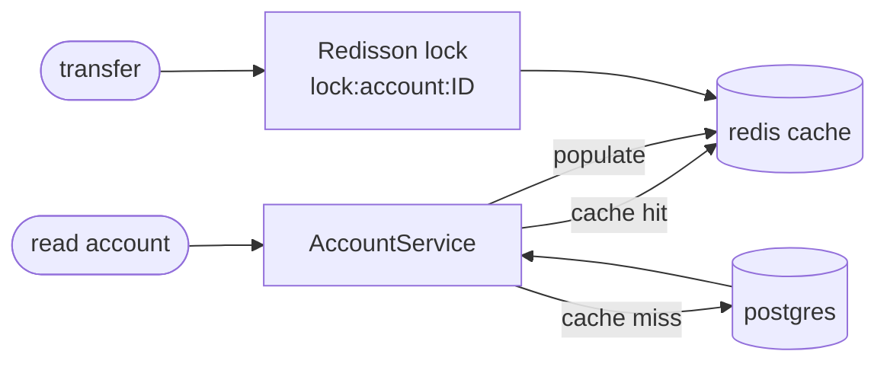

# Redis guide (SecureBank)

Redis 7 plays three roles in SecureBank:

1. **Cache** — hot read paths (e.g. account lookups) via Spring Cache, so we
   don't hit Postgres for every request. This is the **Decorator** pattern from
   the spec ("caching decorator over account read").
2. **Rate-limit counters** — login attempts / API throttling counters with TTLs.
3. **Distributed locks** — **Redisson** locks keyed by account id, so money
   movement is correct even across multiple backend pods.

All commands are copy-pasteable. From the host, Redis is at `localhost:6379`;
inside the network the host is `redis:6379`.

---

## 1. How it fits together



- On a **read**, the service checks Redis first; on a miss it reads Postgres and
  populates the cache (with a TTL).
- On a **write** (deposit/withdraw/transfer), the cached account entry is
  **evicted** so the next read reflects the new balance.
- On **money movement**, a Redisson lock (`lock:account:<id>`) is acquired before
  the DB row locks, guaranteeing single-writer semantics across pods.

---

## 2. Start it

```bash
cd infra
docker compose up -d redis
# or as part of the full stack:
docker compose up -d
```

Verify:

```bash
docker compose exec redis redis-cli ping     # -> PONG
```

---

## 3. redis-cli basics

Open an interactive CLI:

```bash
docker compose exec redis redis-cli
```

Or run one-off commands:

```bash
docker compose exec redis redis-cli INFO server | head
docker compose exec redis redis-cli DBSIZE        # number of keys
```

---

## 4. Inspect cache keys & TTLs

Spring Data Redis typically namespaces cache entries like
`<cacheName>::<key>` (e.g. `accounts::1`). Redisson lock keys look like
`lock:account:1`.

```bash
# List keys by pattern (SCAN is safe on large DBs; KEYS is fine for local/dev)
docker compose exec redis redis-cli --scan --pattern 'accounts*'
docker compose exec redis redis-cli --scan --pattern 'lock:*'

# Look at a value's type and content
docker compose exec redis redis-cli TYPE 'accounts::1'
docker compose exec redis redis-cli GET  'accounts::1'      # if it's a String

# Check remaining TTL (seconds; -1 = no expiry, -2 = key absent)
docker compose exec redis redis-cli TTL 'accounts::1'
```

Watch commands in real time (great for seeing cache hits/misses while you click
around the app):

```bash
docker compose exec redis redis-cli MONITOR
```

> `MONITOR` is verbose and impacts performance — use it briefly, for debugging
> only, never in production.

---

## 5. Inspect distributed locks (Redisson)

Redisson implements locks as a hash with a lease TTL. While a transfer holds a
lock you'll see the key transiently:

```bash
docker compose exec redis redis-cli --scan --pattern 'lock:*'
docker compose exec redis redis-cli TTL 'lock:account:1'   # lease time left
docker compose exec redis redis-cli HGETALL 'lock:account:1'
```

A lock that **lingers** with a long TTL after a request finished can indicate a
crashed holder; Redisson's lease TTL means it self-expires (no permanent
deadlock). If you must clear one manually in dev:

```bash
docker compose exec redis redis-cli DEL 'lock:account:1'   # dev only!
```

---

## 6. How cache invalidation works

- **Read** methods are annotated `@Cacheable("accounts")` → stored on first read.
- **Write** methods (`deposit`/`withdraw`/`transfer`) use `@CacheEvict` (or
  `@CachePut`) on the affected account, so stale balances never linger.
- TTLs provide a safety net: even without explicit eviction, entries expire.

You can prove invalidation locally:

```bash
# 1. Read an account (populates cache), then:
docker compose exec redis redis-cli GET 'accounts::1'
# 2. Do a deposit via the API, then re-check — the key should be gone/updated:
docker compose exec redis redis-cli GET 'accounts::1'
```

---

## 7. Flushing the cache

```bash
# Delete a single cache entry
docker compose exec redis redis-cli DEL 'accounts::1'

# Delete everything matching a pattern (dev convenience)
docker compose exec redis redis-cli --scan --pattern 'accounts*' | \
  xargs -r docker compose exec -T redis redis-cli DEL

# Nuclear option — flush the whole DB (DEV ONLY; also clears locks & counters)
docker compose exec redis redis-cli FLUSHALL
```

---

## 8. Rate-limit counters

Login throttling / API rate limits are counters with a TTL, e.g.
`ratelimit:login:<username>` or `ratelimit:ip:<addr>`:

```bash
docker compose exec redis redis-cli --scan --pattern 'ratelimit:*'
docker compose exec redis redis-cli GET 'ratelimit:login:alice'
docker compose exec redis redis-cli TTL 'ratelimit:login:alice'
```

To reset a locked-out tester in dev, `DEL` the counter.

---

## 9. Common errors

| Symptom                                   | Cause / fix                                                                     |
|-------------------------------------------|--------------------------------------------------------------------------------|
| Backend log: `Unable to connect to Redis` | Wrong host. In-container use `redis`, not `localhost`. Compose sets this.       |
| Stale balances in the UI                  | Cache not evicted on write; confirm `@CacheEvict`/TTL, or `DEL` the key in dev. |
| A transfer hangs                          | Couldn't acquire the Redisson lock (another holder); check `lock:*` keys/TTL.   |
| Data gone after restart                   | Expected for a cache. We enable AOF (`--appendonly yes`) but treat Redis as ephemeral. |
| `MISCONF Redis is configured to save...`  | Disk/permission issue on the volume; check `docker compose logs redis`.         |
