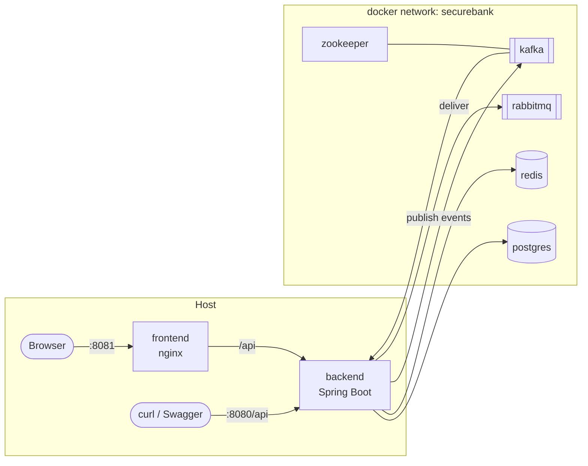

# Running SecureBank locally with Docker Compose

This is the fastest way to bring up the **entire** SecureBank stack — Postgres,
Redis, Kafka (+ Zookeeper), RabbitMQ, the Spring Boot backend, and the React
frontend — on your laptop with one command.

Everything here is copy-pasteable. All commands assume you are in the repo's
`infra/` directory unless stated otherwise.

---

## 1. Prerequisites: install Docker

You need **Docker Engine 24+** and the **Docker Compose v2** plugin (the
`docker compose` subcommand, not the old `docker-compose` binary).

### Linux (Ubuntu/Debian)

```bash
# Install Docker Engine + Compose plugin from Docker's official repo
curl -fsSL https://get.docker.com | sudo sh

# Run docker without sudo (log out / back in afterwards)
sudo usermod -aG docker "$USER"

# Verify
docker --version
docker compose version
```

### macOS / Windows

Install **Docker Desktop** from <https://www.docker.com/products/docker-desktop/>.
It bundles the Compose v2 plugin. On Windows, use the WSL2 backend and run these
commands from a WSL2 shell.

Give Docker at least **6 GB RAM** (Kafka + Postgres + the JVM are hungry).
Docker Desktop: Settings → Resources → Memory.

---

## 2. Bring the stack up

```bash
cd infra

# One-time: copy the env template (safe defaults; .env is gitignored)
cp .env.example .env

# Build the app images and start everything in the background
docker compose up -d --build
```

First run pulls images and builds the backend (Maven) + frontend (npm) inside
their Dockerfiles, so it can take several minutes. Subsequent runs are fast.

Watch it come up:

```bash
docker compose ps
```

You're ready when `securebank-backend` shows `healthy` and `securebank-frontend`
is `running`. The `kafka-init` container is expected to show `exited (0)` — it's
a one-shot job that creates the Kafka topics and then stops.

---

## 3. What each service is

| Service              | Container                 | Purpose                                                            |
|----------------------|---------------------------|-------------------------------------------------------------------|
| `postgres`           | securebank-postgres       | PostgreSQL 16 — system of record (accounts, ledger, etc.)         |
| `redis`              | securebank-redis          | Cache, rate-limit counters, Redisson distributed locks            |
| `zookeeper`          | securebank-zookeeper      | Coordination for Kafka                                             |
| `kafka`              | securebank-kafka          | Domain-event backbone (transactions, fraud-alerts, notifications) |
| `kafka-init`         | securebank-kafka-init     | One-shot: creates the 3 spec topics, then exits                   |
| `rabbitmq`           | securebank-rabbitmq       | Notification delivery work queue (+ management UI)                 |
| `backend`            | securebank-backend        | Spring Boot API (profile `docker`)                                |
| `frontend`           | securebank-frontend       | React app served by nginx                                         |
| `kafka-ui`*          | securebank-kafka-ui       | Web UI for Kafka (observability profile only)                     |
| `prometheus`*        | securebank-prometheus     | Metrics scraping (observability profile only)                     |
| `grafana`*           | securebank-grafana        | Dashboards (observability profile only)                           |

\* Only started with `--profile observability` (see §8).

---

## 4. Ports table

| What                         | URL / host port                                  |
|------------------------------|--------------------------------------------------|
| Frontend (React via nginx)   | <http://localhost:8081>                           |
| Backend API base             | <http://localhost:8080/api>                       |
| Swagger UI                   | <http://localhost:8080/api/swagger-ui.html>       |
| OpenAPI JSON                 | <http://localhost:8080/api/v3/api-docs>           |
| Actuator health              | <http://localhost:8080/api/actuator/health>       |
| Postgres                     | `localhost:5432` (db/user/pass `securebank`)      |
| Redis                        | `localhost:6379`                                  |
| Kafka bootstrap (host)       | `localhost:9092`                                  |
| RabbitMQ AMQP                | `localhost:5672`                                  |
| RabbitMQ management UI       | <http://localhost:15672> (user/pass `securebank`) |
| kafka-ui*                    | <http://localhost:8082>                           |
| Prometheus*                  | <http://localhost:9090>                           |
| Grafana*                     | <http://localhost:3000> (admin/admin)             |

Change any host port in `.env` (e.g. `BACKEND_PORT=9090`).

---

## 5. Reaching the app

### Frontend
Open <http://localhost:8081>. The nginx in the frontend image serves the SPA and
(in k8s) proxies `/api`. Locally the React app talks to the backend at
`http://localhost:8080/api` per its build config.

### Swagger UI (try the API interactively)
Open <http://localhost:8080/api/swagger-ui.html>, then:

1. `POST /api/auth/register` to create a user.
2. `POST /api/auth/login` to get a JWT access token.
3. Click **Authorize** in Swagger, paste `Bearer <access_token>`.
4. Call `POST /api/accounts`, `POST /api/transactions/deposit`, etc.

### Quick smoke test with curl

```bash
# Health
curl -s http://localhost:8080/api/actuator/health | jq

# Register
curl -s -X POST http://localhost:8080/api/auth/register \
  -H 'Content-Type: application/json' \
  -d '{"username":"alice","email":"alice@example.com","password":"Password123!"}' | jq

# Login -> capture the access token
TOKEN=$(curl -s -X POST http://localhost:8080/api/auth/login \
  -H 'Content-Type: application/json' \
  -d '{"username":"alice","password":"Password123!"}' | jq -r .accessToken)

# Open a savings account
curl -s -X POST http://localhost:8080/api/accounts \
  -H "Authorization: Bearer $TOKEN" -H 'Content-Type: application/json' \
  -d '{"type":"SAVINGS","currency":"INR"}' | jq

# Deposit (fires a Kafka transaction event -> notification flow)
curl -s -X POST http://localhost:8080/api/transactions/deposit \
  -H "Authorization: Bearer $TOKEN" -H 'Content-Type: application/json' \
  -d '{"accountId":1,"amount":"1000.00","currency":"INR","description":"opening"}' | jq
```

> Exact request bodies are whatever the backend team implements; the shapes above
> follow the spec's API surface and data model. Always check Swagger for the
> authoritative schema.

---

## 6. Logs

```bash
# Tail everything
docker compose logs -f

# One service
docker compose logs -f backend
docker compose logs -f kafka

# Last 200 lines, no follow
docker compose logs --tail=200 backend
```

---

## 7. Healthchecks & troubleshooting

```bash
# Status + health of every service
docker compose ps

# Inspect a container's healthcheck result
docker inspect --format '{{json .State.Health}}' securebank-backend | jq
```

| Symptom                                            | Likely cause / fix                                                                                       |
|----------------------------------------------------|----------------------------------------------------------------------------------------------------------|
| `backend` stuck "starting" / unhealthy             | It waits for Postgres/Redis/Kafka/RabbitMQ to be healthy. Check their logs; give it up to 60s start grace.|
| `backend` can't reach DB                            | Inside the network the host is `postgres:5432`, not `localhost`. The compose env sets this already.       |
| Kafka clients on host fail to connect              | Use `localhost:9092` from the host; containers use `kafka:29092`. See `kafka-guide.md`.                   |
| `kafka-init` shows failed                           | Kafka wasn't healthy yet; `docker compose up -d kafka-init` re-runs it.                                   |
| Port already in use (`5432`, `8080`, ...)           | Change the host port in `.env`, then `docker compose up -d`.                                              |
| Out of memory / containers killed                  | Increase Docker memory to 6 GB+.                                                                          |
| Stale data after schema change                     | Wipe volumes: `docker compose down -v` (DESTROYS DB DATA), then `up`.                                     |

---

## 8. Observability profile (optional)

```bash
# Start the core stack PLUS kafka-ui, prometheus, grafana
docker compose --profile observability up -d

# kafka-ui:   http://localhost:8082
# prometheus: http://localhost:9090   (target: securebank-backend)
# grafana:    http://localhost:3000   (admin/admin; Prometheus pre-provisioned)
```

See `observability.md` for dashboards and what to look at.

---

## 9. Rebuilding & lifecycle

```bash
# Rebuild only the backend image after code changes and restart it
docker compose up -d --build backend

# Rebuild everything from scratch (no cache)
docker compose build --no-cache
docker compose up -d

# Restart a single service
docker compose restart backend

# Stop everything (keeps volumes/data)
docker compose down

# Stop AND delete volumes (wipes Postgres/Redis/RabbitMQ/Kafka data)
docker compose down -v

# Open a shell inside a container
docker compose exec backend sh
docker compose exec postgres psql -U securebank -d securebank
```

---

## 10. Architecture at a glance



Next: see `kafka-guide.md`, `redis-guide.md`, `rabbitmq-guide.md`,
`kubernetes-guide.md`, `observability.md`, and `cicd.md`.
